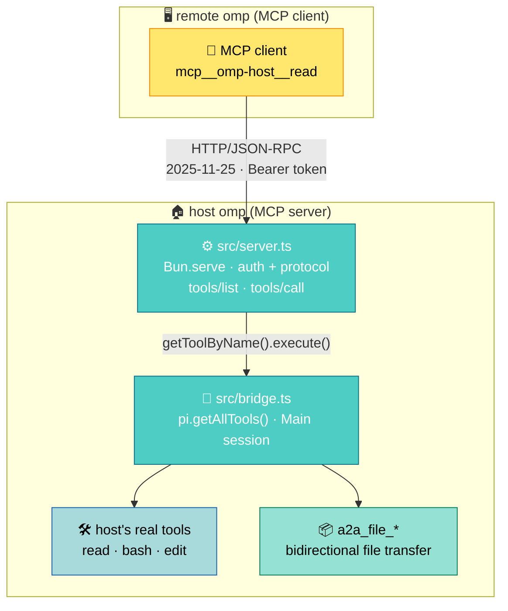

# omp A2A Bridge

[简体中文](README_ZN.md)

The extension starts an MCP server endpoint on the host's `session_start` (MCP `2025-11-25`, Streamable HTTP, bound to `127.0.0.1` by default). A remote omp points its `mcp.json` at it and can then call the tools of the host's `Main` session (`read`/`bash`/`edit`…), running against the host's real files and shell. The host does no model inference — takes the request, runs the tool, returns the result, spends no tokens.

## How it works



- The extension starts `Bun.serve` on `session_start` and implements MCP `2025-11-25`'s `initialize` / `tools/list` / `tools/call`, answering with plain JSON (no SSE).
- The tool catalog comes from the host's current session (`pi.getAllTools()`); execution always routes to `getToolByName` on the host's `Main` session, so calls run the host's own tool implementations.
- Alongside the host tools, the bridge contributes 6 `a2a_file_*` tools of its own (bidirectional file transfer, see [File transfer](#file-transfer)): appended after the host tools, yielding to the host on a name collision, and equally subject to `deny`.
- Remote calls involve no model inference at all: the host only receives a request, runs a tool, and returns the result.

## Install

On any machine, from the git URL:

```sh
omp install https://github.com/adam-ikari/pi-a2a-ext.git
```

That installs it into `~/.omp/plugins/node_modules/pi-a2a-ext`. To remove it:

```sh
omp plugin uninstall pi-a2a-ext
```

Already have a checkout? `omp install .` from the repo root links that copy
instead of fetching — handy while developing. The `pi.extensions` field in
`package.json` is what tells omp which entry file to load, so do not remove it.

`omp install` takes a **directory or a git URL, not a `.tgz`** — pointing it at a
tarball fails with `ENOTDIR`. A GitHub `owner/repo` shorthand is rejected as an
invalid package name; use the full `https://….git` URL.

If you would rather bypass the plugin manager, `./scripts/install.sh` symlinks
straight into `~/.omp/agent/extensions/` and additionally verifies the link
resolves and the modules the entry point imports are present. It takes
`--status` (report state, non-zero if broken) and `--uninstall`; set
`OMP_AGENT_DIR` to target somewhere other than `~/.omp/agent`.

> Do not replace any of these with a bare
> `ln -s "$PWD/extensions/a2a-bridge.ts" ...`. That one-liner only works when
> `$PWD` happens to be the repo root; run it from anywhere else and it silently
> links a path that does not exist, and the bridge simply never comes up.

On first start the bridge generates its own config, token and file sandbox
under `~/.omp/agent/`, so there is nothing else to set up per machine.

After starting the host omp, the notification bar shows:

```
A2A bridge listening on http://127.0.0.1:<port> (token <first 6 chars>…)
```

`<port>` is the actual listening port (random by default).

## Configuration

The config file is `~/.omp/agent/a2a-bridge.json`, generated on first start with mode `0600` (created at that mode, so there is no permission window):

```json
{ "port": 0, "token": "<base64url 32B>", "host": "127.0.0.1", "deny": [], "denyMCPTools": false, "maxFileBytes": 104857600 }
```

| Field | Meaning |
| --- | --- |
| `port` | `0` = random port; set a number to pin it |
| `token` | Bearer token, generated on first start |
| `host` | Listen address, default `127.0.0.1` (a warning is added if you change it to `0.0.0.0`) |
| `deny` | Tool names to withhold |
| `denyMCPTools` | `true` excludes every `mcp__`-prefixed tool |
| `fileRoot` | Sandbox root for file transfer, default `~/.omp/a2a-bridge-files` (same `~/.omp` as the config/audit files but a **different directory**). To change it, write an **absolute path** — `~` is not expanded in config |
| `maxFileBytes` | Per-file size cap, default `104857600` (100MB), allowed range 1KB–1GB |

`A2A_BRIDGE_CONFIG` overrides the config path; `A2A_BRIDGE_AUDIT` overrides the audit log path.

Validation is **fail-closed**: a present-but-malformed field (`port` not an integer or out of range, `deny` not an array of strings, `denyMCPTools` not a boolean, `host` not a non-empty string, `fileRoot` not an absolute path, `maxFileBytes` not an integer or out of range) makes the extension refuse to start and report an error, rather than running with a wrong exposure surface. The one exception is `token`: when missing or invalid it is regenerated and **written back to the config**, so it stays stable across restarts.

Other config edits (such as `deny`) take effect on the **next host restart**; to change only the token at runtime, use `/a2a rotate` (immediate, and the old token stops working at once).

### Commands

Inside a host session:

- `/a2a` — show the current listen address, port, token prefix, file sandbox root and size cap (`files disabled` when the sandbox is unavailable)
- `/a2a rotate` — rotate the token (update the remote `mcp.json` afterwards)
- `/a2a token` — print the full token (the status line only shows a prefix)

## Remote connection example

The remote omp's `mcp.json`:

```json
{
  "mcpServers": {
    "omp-host": {
      "type": "http",
      "url": "http://127.0.0.1:<port>/",
      "headers": { "Authorization": "Bearer <token>" }
    }
  }
}
```

Once connected, the remote side sees tools like `mcp__omp-host__read` and `mcp__omp-host__bash` and can call them directly.

## Cross-machine forwarding

Loopback-only by default, never exposed to the network. Forward the port over SSH from the remote machine:

```sh
ssh -L <localport>:127.0.0.1:<port> user@host
```

Then set `mcp.json`'s `url` to `http://127.0.0.1:<localport>/`.

## Approval

Remote calls reuse the host's approval gate (`ExtensionToolWrapper`) entirely and open no additional permissions:

- The host's default `approvalMode` is `yolo` → straight through, no approval step.
- If the host configures a tool as `prompt` in `tools.approval` **and** the host has an interactive UI (TUI), the remote call raises an Approve/Deny prompt; once the user confirms, it continues and the result returns by the same path.
- With no interactive UI (measured in rpc mode; print takes the same no-UI path but is untested), a `prompt` approval **neither executes the command nor returns**: the request hangs indefinitely (measured ≥90s) while the host waits for a UI answer that can never arrive. **Callers must impose their own timeout**; a hung call leaves a `start` record with no matching `done` in the audit log (see below), so it is detectable.

## File transfer

The bridge ships 6 `a2a_file_*` tools that move files in both directions: remote → host (push) and host → remote (pull). They travel the same `tools/list` / `tools/call` pipeline as host tools, so they inherit the same auth, session, `deny` gate and audit trail; **no new JSON-RPC methods are added**. The wire format reuses the A2A FilePart `{name, mimeType, bytes(base64)}` shape.

- Remote tool names look like `mcp__omp-host__a2a_file_put` (the prefix depends on the server name in `mcp.json`).
- Every `path` is relative to `fileRoot` (the sandbox root, created `0700` at startup), **not** a host filesystem path. Writes always land atomically (write `fileRoot/.tmp/<uuid>.part` first, then `rename`), with file mode `0600`.
- The per-file cap is `maxFileBytes` (default 100MB). Inline and per-chunk payloads decode to ≤ 512KiB, and a single read response is ≤ 256KiB:

```text
# small file (≤512KB) in one call
a2a_file_put { "path": "inbox/note.md", "file": { "mimeType": "text/markdown", "bytes": "<base64>" } }

# large file in chunks (100MB ≈ 200 chunks); seq starts at 0 and must be contiguous
a2a_file_put_start { "path": "bulk/data.tar", "totalBytes": 1048576 }   -> { "transferId": "..." }
a2a_file_put_chunk { "transferId": "...", "seq": 0, "bytes": "<base64>" }
a2a_file_put_end   { "transferId": "..." }                              -> { "path", "bytes", "sha256" }

# reading (page until eof)
a2a_file_get { "path": "bulk/data.tar", "offset": 0, "limit": 262144 }  -> { "bytes", "totalBytes", "eof" }
a2a_file_list { "path": "inbox" }                                       -> { "entries": [...] }
```

- Failures are always `isError: true` plus the text `a2a_file_error <code>: <message>`, where `<code>` is a stable enum (`invalid_path` `escapes_root` `symlink_refused` `not_found` `is_a_directory` `already_exists` `too_large` `bad_base64` `bad_chunk_order` `unknown_transfer` `size_mismatch` `io_error`). **No bare errno, no host paths**: when the host filesystem itself fails (`ENOTDIR`/`EISDIR`/`ENOSPC` and friends) the call reports the catch-all code `io_error`, and the details go only to the host's stderr. Protocol details (chunk retry idempotency, the staging directory not being addressable, chunk state bound to a session, 30-minute idle reclamation, caps) are in [docs/protocol.md](docs/protocol.md) under "The bridge's own tools".
- **Retransmits are idempotent**: the same `seq` with the same `bytes` arriving again is treated as already received (returning `duplicate: true`) instead of being appended twice, so the file is never corrupted — as noted above, "callers must impose their own timeout" makes a timeout retry a routine move. The same `seq` with *different* content is still `bad_chunk_order`.
- `deny` applies to these tools too: `"deny": ["a2a_file_put", "a2a_file_put_start", "a2a_file_put_chunk", "a2a_file_put_end"]` leaves reads but no writes. To turn file transfer off entirely, deny all 6 names.

## Security and boundaries

- **The token is full tool-execution authority (under the default config)**: the host's default `approvalMode: yolo` means anyone holding the token can execute any exposed tool (including `bash`) directly in the host session with no approval step; only tools the host configures as `prompt` have a gate that can stop them (see [Approval](#approval) for the no-UI case). Keep the config file at `0600` and out of version control.
- **The bridge's own tools (file transfer) do not pass through the host's approval gate**: `a2a_file_*` are not host tools, so `tools.approval` has no effect on them — holding the token equals read/write authority **inside** `fileRoot` (a deliberate trade-off: it buys reuse of the same pipeline). The sandbox is what holds the line: paths reject absolute paths, `..`, NUL, control characters and `.` segments; the deepest existing ancestor is `realpath`ed and must still be inside `fileRoot`; symlinks inside the root are neither followed for reading nor for writing (`symlink_refused`, `a2a_file_list` included — otherwise it would leak filenames/sizes/mtimes from outside the root); `fileRoot` itself must not be a symlink, nor an ancestor of the config file or audit log (otherwise startup fails). **The staging directory `.tmp` is not addressable** (a leading `.tmp` segment is always `invalid_path`): a transfer is bound to an `Mcp-Session-Id`, but the staged bytes are ordinary files, so if `.tmp` were reachable any client could enumerate other sessions' `transferId`s and read or rewrite their in-flight uploads.
- **Bytes pulled back land in the remote context**: `a2a_file_get`'s base64 is a tool result and enters the remote model's session history. The protocol supports 100MB, but large binaries should go over SSH/`scp` instead of this channel.
- Loopback-only by default; if you really do expose it, the firewall is your responsibility.
- **Exposure semantics = the full session tool registry**: `tools/list` comes straight from `pi.getAllTools()` (the Main session registry), so it includes `hidden` tools and tools the host model currently has disabled — it is *not* a mirror of "what the host model can currently see". Tighten it with `deny` / `denyMCPTools`.
- **Calls and the list share one source**: `tools/call` only accepts names that appear in `tools/list` (after deny filtering); aliases (such as `xd://bash`) and unlisted names are refused, and a refusal does not distinguish "denied" from "nonexistent" (so it does not leak whether a name exists). The deny decision is made once on each side, list and call.
- **Sessions are mandatory**: every message except `initialize` must carry `Mcp-Session-Id` (missing → 400, unknown or idle past 24h → 404). At most 64 sessions are tracked, with the least-recently-seen evicted beyond that; every hit refreshes the idle timer.
- **Audit log**: every remote `tools/call` writes two JSONL records — `{ts,id,sid,phase:"start",tool,args}` at dispatch and `{ts,id,sid,phase:"done",tool,isError,args}` on completion (paired by the same `id`; `sid` is that call's `Mcp-Session-Id`, so under a shared token each call is attributable to a client session; the args summary is truncated to 1KB) — to `~/.omp/agent/a2a-bridge.log`, mode 0600, rotating to `.1` past 512KB. **A `start` with no `done` means the call was dispatched but never completed** (typically: an approval hung for want of a UI); if rotation lands mid-call, the paired records can end up split across `.1` and the current file. Audit write failures never affect the call. Strings longer than 120 characters in the args (file base64 bodies) are recorded as `<len:N,sha256:first 8>` so the log never holds payloads; `a2a_file_put_chunk` is not recorded at all (one upload would otherwise be hundreds of lines), with the start/end records bracketing the whole transfer.
- If the configured port is busy, the bridge falls back to an ephemeral port and warns (update the port in the remote `mcp.json`).

The full wire contract — request/response shapes, processing order, session lifecycle and the error-code table — is in [docs/protocol.md](docs/protocol.md).

Online docs (GitHub Pages, published on push): <https://adam-ikari.github.io/pi-a2a-ext/>

v1 boundaries:

- Tools only (`tools/list` + `tools/call`); no resources, no prompts.
- No SSE push, no call cancellation.
- Always routed to the host's `Main` session.
- Static Bearer token, no OAuth.
- No concurrency or rate limiting.

## Troubleshooting

- **401 `unauthorized`**: the token does not match. The remote `mcp.json`'s `Authorization` header must equal the config's `token`; update the remote side after `/a2a rotate`.
- **400 `missing mcp-session-id` / 404 `unknown session`**: every message except `initialize` needs the session header. Sessions are in-memory in the host process — they all die when the host restarts and are reclaimed after 24h idle; run `initialize` again for a new session (a well-behaved MCP client library does this automatically).
- **Cannot connect / wrong port**: if the configured port is busy at host startup, the bridge falls back to a random port and warns in the notification bar — use the actual port shown there or in `/a2a` to update `mcp.json`.
- **A call never returns**: the host has no interactive UI and the tool's approval is `prompt` (see [Approval](#approval)) — the command does not execute, but neither does the call return; the caller must impose its own timeout, and the audit log shows a `start` with no `done` for that call (see the audit-log bullet under [Security and boundaries](#security-and-boundaries)).
- **500 `internal error`**: an internal server fault; the response body is deliberately detail-free (to avoid leaking), and the real cause is in the host's stderr as `[a2a-bridge] internal error: …`.
- **Config edits do not take effect**: external edits to `a2a-bridge.json` (such as `deny` or `port`) need a host restart; only `/a2a rotate` applies live at runtime.
- **`bun test` version guard fails** (development): the installed `@oh-my-pi/pi-*` is out of sync with the pin/lock — `bun install` restores it; an `omp --version` that differs from the pin only warns, so update the two exact versions in `package.json` when you upgrade the host.

## Development

```sh
bun install

bun run typecheck     # type check
bun run lint          # lint + format check (Biome; fix with bunx biome check --write .)
bun test              # unit tests: test/*.test.ts (protocol/auth/config/exposure gate/audit/version guard)
bun run test:smoke    # real E2E (needs a local omp + ~/.omp/agent/models.yml; run manually)
bun run test:hardening # real-host hardening checks, 29 items (needs a local omp; run manually)
bun run test:approval  # approval-boundary discriminating probe, ~2 minutes (needs a local omp; run manually)
bun run test:files    # real-host file-transfer checks, 71 items (needs a local omp; run manually)
bun run test:install  # cross-machine install check, 26 items (isolated HOME + omp install <git-url>; run manually)
./scripts/install.sh   # install the extension into ~/.omp/agent/extensions (--status / --uninstall)
bun run website        # local docs site preview (Docusaurus) at http://localhost:3000; first run `cd website && bun install`
```

What each test covers, the preconditions for the real-host probes, and how to read their verdicts (including the approval probe's VERDICT A/B/C semantics) are in [docs/testing.md](docs/testing.md).

Dependency note: `@oh-my-pi/pi-coding-agent` and `@oh-my-pi/pi-ai` are pinned to **exact versions** in `devDependencies`, kept in step with the host omp version, and used only for type checking and unit tests. **Do not load them from `node_modules` at runtime** — the host omp's `omp:legacy-pi-shim` redirects those imports to the same modules bundled inside the host, which is what lets module-level singletons like `AgentRegistry.global()` be shared; update both version numbers when upgrading omp. `bun test` includes a **version guard**: an installed devDep that differs from the pin fails outright, and an `omp --version` that differs from the pin only warns.

File layout:

| Path | Responsibility |
| --- | --- |
| `extensions/a2a-bridge.ts` | Extension entry point: starts the server on `session_start`, registers `/a2a` |
| `src/server.ts` | `Bun.serve` + JSON-RPC (MCP 2025-11-25, plain JSON responses), sessions and version negotiation |
| `src/bridge.ts` | Tool catalog and execution (`pi.getAllTools` / AgentRegistry Main session), exposure-intersection decision |
| `src/fileguard.ts` | Path sandbox: lexical rejection, realpath containment, symlink refusal, atomic writes |
| `src/filetools.ts` | The bridge's own `a2a_file_*` tools, chunked transfers, error-code mapping |
| `src/config.ts` | Config load/save, field validation, token generation, deny decision |
| `src/auth.ts` | Bearer token verification (timing-safe comparison) |
| `src/audit.ts` | Audit log for remote calls (two-phase JSONL `start`/`done`, rotation) |

Change history: [CHANGELOG.md](CHANGELOG.md).

## License

MIT, see [LICENSE](LICENSE).
