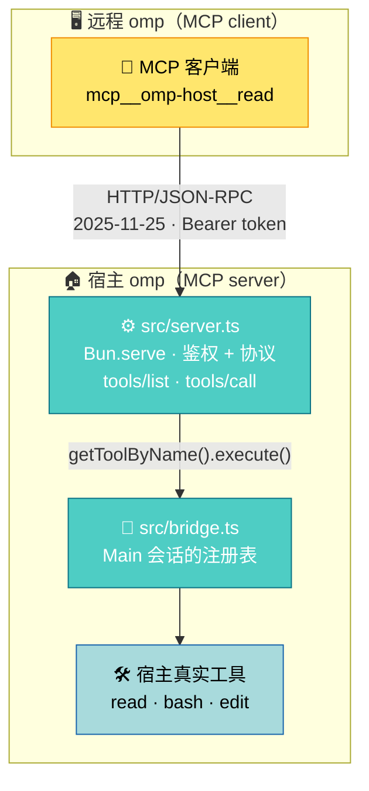

# omp A2A Bridge

[English](README.md) | 简体中文

这个扩展在宿主 `session_start` 时起一个 MCP 服务器接口（MCP `2025-11-25`，Streamable HTTP，默认只绑 `127.0.0.1`）。远程 omp 的 `mcp.json` 指向它，即可调用宿主 `Main` 会话里的工具（`read`/`bash`/`edit`…），执行落在宿主真实的文件与 shell 上。宿主不做模型推理——收请求、跑工具、回结果，不消耗 token。

## 什么时候用哪个

宿主自带 `omp acp`：编辑器（比如 Zed）启动它，把提示词交给它，它自己调模型、自己干活，
结果流回编辑器显示。**要一个能替你干活的本地 agent，用它。**

本桥不干活。发过来的是工具名和参数，桥把它们交给宿主执行，再把结果原样送回——**推理发生在
调用方。** 所以你要的如果是「我自己推理，只借你这台机器的手脚」，用本桥。

两者没法互相替代。`ssh host 'omp acp'` 也不行：那启动起来的是另一个会自己推理的
agent，不是你手上那套模型。

| | `omp acp` | 本桥 |
| --- | --- | --- |
| 谁推理 | omp | 调用方 |
| 传输 | stdio | Streamable HTTP + Bearer |
| 谁连上来 | 代码编辑器 | 任何 MCP 客户端 |

## 工作原理



- 扩展在 `session_start` 时启动 `Bun.serve`，实现 MCP `2025-11-25` 的 `initialize` / `tools/list` / `tools/call`，响应为纯 JSON（无 SSE）。
- 端点是**每进程**一个，而宿主的 `session_start` / `session_shutdown` 是**每会话**一个（task 子代理、ACP 会话、持久化 revive 各有自己一套 handler）。后来的 `session_start` 复用已起的服务器（同时在途的两个只绑一个端点）；`session_shutdown` 只在宿主注册表里没有活的 `Main` 会话时才释放端口（宿主把 `AgentRef.session` 注释成「parked/aborted 时恰为 null」，而 `tools/call` 本来就拒绝那个状态），否则任何一次子代理结束都会把还在服务的端口拆掉。若那个事件落在绑定完成之前，它手里还没有端口可停，于是绑定的那一方完成后回头看一眼注册表：`Main` 没了就把刚绑上的端口收掉。释放用的是非强制的 `stop()`：监听立刻关、新建连接一律被拒，而已经在处理的那一次照常跑完并落审计——强制切断会让 `tools/call` 少一行 `done`，让 `POST /blob` 整条上传不留记录地消失。
- 目录、暴露门与执行读同一份注册表：宿主的 `Main` 会话（`getAllToolInfos()`，宿主也正是用它接出 `pi.getAllTools()`），执行随后就在同一个会话上按 `getToolByName` 解析名字。没有活的 `Main` 时（parked/aborted，端口尚未释放那一段），目录退回绑定它的那套 runner 自己的视图，而不是报出一份宿主其实并没有的空注册表。
- 目录就是宿主注册表本身，桥不过滤（见「安全与边界」）。
- 远程调用不经过任何模型推理：宿主只做「收请求 → 跑工具 → 回结果」。

## 安装

任意机器上，从 git URL 装：

```sh
omp install https://github.com/adam-ikari/pi-a2a-ext.git
```

它会装到 `~/.omp/plugins/node_modules/pi-a2a-ext`。卸载：

```sh
omp plugin uninstall pi-a2a-ext
```

**只有这一条安装路径。** `omp install` 本身也接受目录和 npm spec，但本扩展不提供
本地安装方式：装的就是上面那个 git URL 对应的仓库。`package.json` 里的
`pi.extensions` 字段是告诉 omp 该加载哪个入口文件的，**不要删掉它**。

URL 必须是完整的 `https://….git`——GitHub 的 `owner/repo` 简写会被当作非法包名
拒绝；指向 `.tgz` 会报 `ENOTDIR`。

上面这些是实测过的，`bun run test:install` 也覆盖：核验发布包、再起一个宿主、
以远程客户端身份把桥的 MCP 面走完。做不到的是假装机器是干净的——宿主解析
`~/.omp/plugins` 不受 `HOME` 影响，也没有环境变量能改道，所以端到端那半程跑的是
`omp install` 真实写入的那个插件目录。见 [docs/testing.md](docs/testing.md)。

也别手工软链到 `~/.omp/agent/extensions/`：`ln -s "$PWD/extensions/a2a-bridge.ts" ...`
只在 `$PWD` 恰好是仓库根目录时有效，换个目录执行就链到一个不存在的路径，桥静默地
不启动，而宿主不会报错。

首次启动时桥会在 `~/.omp/agent/` 下自行生成配置与 token，所以每台机器无需额外
配置。

启动宿主 omp 后，通知栏显示：

```
A2A bridge listening on http://127.0.0.1:<port> (token <前6字符>…)
```

`<port>` 是实际监听端口（默认随机）。

## 配置

配置文件 `~/.omp/agent/a2a-bridge.json`，首次启动自动生成，权限 `0600`（创建时即 0600，无权限窗口）：

```json
{ "port": 0, "token": "<base64url 32B>", "host": "127.0.0.1" }
```

| 字段 | 含义 |
| --- | --- |
| `port` | `0` = 随机端口；写具体数字则固定 |
| `token` | Bearer token，首次启动自动生成 |
| `host` | 监听地址，默认 `127.0.0.1`（改成 `0.0.0.0` 会额外告警） |

只有这三个字段。**没有工具白名单或黑名单，没有文件沙箱**——桥不替宿主做权限决定，配置里加这些字段不会生效（多余字段被忽略）。

环境变量 `A2A_BRIDGE_CONFIG` 可覆盖配置文件路径；`A2A_BRIDGE_AUDIT` 可覆盖审计日志路径。

校验是 **fail-closed** 的：字段类型非法（`port` 非整数/越界、`host` 非非空字符串）时扩展拒绝启动并报错。唯一的例外是 `token`：缺失或非法时自动生成并**写回配置**，保证跨重启稳定。

配置文件的改动在**下次重启宿主**后生效；运行中只想换 token 用 `/a2a rotate`（立即生效，旧 token 即刻作废）。

### 命令

宿主会话内：

- `/a2a` — 显示当前监听地址、端口与 token 前缀
- `/a2a rotate` — 轮换 token（写完配置后需同步更新远程 `mcp.json`）
- `/a2a token` — 打印完整 token（状态行只显示前缀）

## 远程连接示例

远程 omp 的 `mcp.json`：

```json
{
  "mcpServers": {
    "omp-host": {
      "type": "http",
      "url": "http://127.0.0.1:<port>/",
      "headers": { "Authorization": "Bearer <token>" }
    }
  }
}
```

连上后远程侧会看到 `mcp__omp-host__read`、`mcp__omp-host__bash` 之类的工具，直接调用即可。

## 跨机转发

默认只绑回环，不对外网开放。远程机做 SSH 端口转发：

```sh
ssh -L <localport>:127.0.0.1:<port> user@host
```

`mcp.json` 的 `url` 写 `http://127.0.0.1:<localport>/`。

## 审批

远程调用完全复用宿主的审批门（`ExtensionToolWrapper`），不额外开权限：

- 宿主默认 `approvalMode` 为 `yolo` → 直通，没有审批环节。
- 若宿主把某个工具在 `tools.approval` 配成 `prompt`，且宿主有交互 UI（TUI），远程调用会弹 Approve/Deny，用户确认后继续，结果原路返回。
- 宿主无交互 UI 时（rpc 模式实测；print 同为无 UI 路径，未实测），`prompt` 类审批**不会执行命令，但也不返回**：请求一直挂起（实测 ≥90s），宿主在等一个永远不会出现的 UI 应答。**调用方必须自设超时**；挂起的调用会在审计日志留下 `start` 记录而无配对的 `done`（见下），可据此发现。

## 传文件

远程 agent 要把固件、镜像这类二进制放到宿主机上烧写，走 `POST /blob`——收原始字节，不用先 base64：

```sh
curl -X POST --data-binary @firmware.bin \
  -H "Authorization: Bearer $TOKEN" \
  "http://127.0.0.1:<port>/blob?path=/tmp/firmware.bin"
```

单次上限 128 MB——实测 100 MB 的镜像一次请求就传完，字节一致，0.4 秒。不带 `offset` 就是追加，带上则必须等于当前文件大小，否则 409。更大的文件分块传，每块也是原始字节。完整约定见 [协议参考](docs/protocol.md)。

注意内存：请求体在到达 handler 之前由 Bun 缓冲，所以代价是**每个在途请求**的内存。实测宿主 RSS 空闲 368 MB、一次 100 MB 上传后 624 MB、两次并发后 846 MB。并发上传要限量。

**下载走不通。** 三处宿主侧的限制叠在一起，任一条单独都足以卡住：

- `read` 单行超 150 KB 直接拒绝，报 `exceeds 150.0KB limit`；1 MB 的多行文件只回来约 16 KB
- `bash` 输出超 768 字节就截断，尾巴指向 `artifact://N`
- `read artifact://N` 自己也截断在约 150 KB

所以远程 agent 拿不回本机的大文件，只能读小片段（实测 20 段 `dd` 累计约 3.2 MB / 4 MB，有缺口）。`/blob` 只解决上传。

纯文本或小文件直接用 `write` 工具（单次约 900 KB）更省事，只是不走 `/blob` 的路径。

## 设备

设备在宿主那边有两种形态，桥都原样透传。

**工具链（`bash`）**。`adb`、`idf.py`、串口工具、烧录器都不是 omp 的工具，是本机上的命令。`bash` 在 `tools/list` 里，于是远程直接跑：

```json
{ "jsonrpc": "2.0", "id": 1, "method": "tools/call",
  "params": { "name": "bash", "arguments": { "command": "adb devices -l" } } }
```

执行落在本机的 shell，PATH 上有什么就有什么——装了 Android SDK 就调得到 adb，ESP-IDF 装了就能 `idf.py flash`。端口监视、寄存器读写同理。

**挂载设备（`xd://`）**。宿主把工具挂成虚拟设备，**它们不在 `tools/list` 里**，而是通过 `read` / `write` 的 `path` 参数驱动：

```json
{ "name": "read",  "arguments": { "path": "xd://" } }              // 列出挂载的设备
{ "name": "read",  "arguments": { "path": "xd://debug" } }         // 取该设备的文档与 JSON schema
{ "name": "write", "arguments": { "path": "xd://debug", "content": { … } } }  // 执行
```

清单由宿主运行时决定——装了哪些扩展、接了什么设备，就有什么。本机实测挂载的是 `xd://debug`（DAP 调试器）、`xd://lsp`、`xd://ast_edit`。

**`tools/call` 直接叫 `xd://` 会被拒**（`not exposed`）：设备不是独立工具名，只有 `read` / `write` 的 `path` 能到达。这是宿主的形态，桥不改写它。

## 安全与边界

- **token 即工具执行全权（默认配置下）**：宿主默认 `approvalMode: yolo`，拿到 token 就可在宿主会话里直接执行任意暴露的工具（含 `bash`），不经过任何审批；只有宿主把工具配成 `prompt` 才有审批门可拦（无 UI 时见审批节）。配置文件保持 `0600`，不要进版本库。
- **桥不做权限决定**：`tools/list` 就是宿主 `Main` 会话的注册表（`getAllToolInfos()`），原样透传，不过滤。因此它包含 `hidden` 工具、也包含宿主当前对自己模型禁用的工具——**omp 是什么权限，桥就是什么权限**。桥没有 `deny` 这类第二套名单：两份名单可以互相矛盾，而代码里没有定义谁优先。要收紧就配宿主自己的工具权限，桥不参与。
- **执行走宿主原生工具**：`tools/call` 固定路由到宿主 `Main` 会话的 `getToolByName().execute()`，注入真实的 `session.settings` 与 `ExtensionContext ui`，所以宿主的审批门（`ExtensionToolWrapper`）照常生效，桥自己一套审批逻辑都没有。
- **调用与列表同源**：`tools/call` 只接受出现在 `tools/list` 里的名字，别名（如 `xd://bash`）和未注册的名字一律拒绝，且不区分「被过滤」与「不存在」（不泄露名字是否存在）。
- **`POST /blob` 是例外，它不经宿主审批门。** 它收原始字节（省掉 base64），直接落盘，桥自己解释路径——**能写宿主能写的任何路径，无根目录、无白名单**。这是刻意的取舍：扩展无法主动发起审批（`ExtensionAPI` 只有 `on("tool_approval_requested", …)`，那是宿主问、扩展答的方向），而唯一能过审批门的写入方式是发一次 `tools/call`，那正是 `/blob` 要避免的编码。审计照旧记 `tool: "blob:write"`，args 只有 `path`/`offset`/`bytes`，文件内容不进日志。详见 [协议参考](docs/protocol.md)。
- 默认仅回环监听；真要对外暴露，防火墙自己负责。
- **会话强制**：除 `initialize` 外所有消息必须携带 `Mcp-Session-Id`（缺失 → 400，未知/空闲超 24h → 404）。会话上限 64 个，超出淘汰最久未用；每次命中刷新空闲计时。
- **审计日志**：每次远程 `tools/call` 写两条 JSONL——发起时 `{ts,id,sid,phase:"start",tool,args}`，完成时 `{ts,id,sid,phase:"done",tool,isError,args}`（同 `id` 配对；`sid` 为该调用的 `Mcp-Session-Id`，共享 token 下可把调用归因到客户端会话；参数摘要截断 1KB）到 `~/.omp/agent/a2a-bridge.log`，权限 0600，超过 512KB 轮转为 `.1`。这里的 `id` 是本桥为配对生成的 UUID，调用方的 JSON-RPC id 不落日志，所以按 JSON-RPC id 查不到。参数里超过 120 字符的字符串只记 `<len:N,sha256:前8位>`，日志不落载荷，且**不分嵌套层数**：宿主 `edit` 的文件正文就落在 `args.edits[0].oldText`（第三层），只走两层的脱敏会把它原样写出去。嵌套超过 32 层整个子树换成 `<max-depth>`，不再往下走。这里说的是桥自己这份日志；宿主会话照常收到那些参数，宿主自己的记录归宿主管。记录按进程内一条队列落盘，因为「查大小 → 轮转 → 写行」是三步而不是一个整体：两个并发写都读到越过上限的尺寸就会都去轮转，第二次 `rename` 覆盖掉的正是第一次刚放好的那个 `.1`。不串行时同一份代码重跑六轮，最坏的一次两个文件各剩 1 条记录——测试摆到磁盘上的 572 条里有 570 条在两个文件都找不到；最轻的一次是并发那 60 条只剩 1 条。日志写失败不影响调用。
- **只有 `start` 没有 `done` = 调用已发起但未完成**（典型：无 UI 下挂起的审批）。读这个信号有两处坑，都实测过：轮转可能把一次调用的两条分处 `.1` 与当前文件，所以要在两个文件里按 `id` 配对；而且只保留一代——下一次轮转会覆盖 `.1`，挂起调用的证据会被后续流量冲出日志。要在它还在的时候读。
- 端口被占用时回退到随机端口并告警（远程 `mcp.json` 需同步改端口）。

与 computer use（看屏幕猜坐标点按）的差别见 [docs/computer-use.md](docs/computer-use.md)。

请求/响应格式、处理顺序、会话生命周期与错误码总表的完整 wire 契约见 [docs/protocol.md](docs/protocol.md)。

在线文档站（GitHub Pages，push 自动发布）：<https://adam-ikari.github.io/pi-a2a-ext/>

v1 边界：

- 只暴露工具（`tools/list` + `tools/call`），无 resources、无 prompts。
- 无 SSE 推送，无调用取消。
- 固定路由到宿主 `Main` 会话。
- 静态 Bearer token，无 OAuth。
- 无并发/速率限制。

设计取舍（想加功能前先看这段）：

- 桥只负责把调用送到，不在途中加意思。宿主已有 `read`/`bash`/`edit` 就能表达的能力，不另造工具；不替宿主判断路径；不按权限过滤目录——**omp 是什么权限，桥就是什么权限**。给桥加一份自己的判断，它就成了第二个 omp。
- 桥自带的工具会绕过宿主审批门，因此必然要自带沙箱。**这是一个决定的两个后果，要一起删**：只删沙盒会留下谁都不管的洞。


## 故障排查

- **401 `unauthorized`**：token 不匹配。远程 `mcp.json` 的 `Authorization` 头必须与配置 `token` 一致；`/a2a rotate` 之后要同步改远程侧。
- **400 `missing mcp-session-id` / 404 `unknown session`**：除 `initialize` 外都要带会话头。会话是宿主进程内存态——宿主重启即全部失效、空闲超 24h 也回收；重新 `initialize` 拿新会话即可（正规 MCP 客户端库会自动处理）。
- **连不上 / 端口对不上**：宿主启动时配置端口被占用会回退到随机端口并在通知栏告警——以通知栏或 `/a2a` 显示的实际端口更新 `mcp.json`。
- **调用一直没有返回**：宿主无交互 UI 且该工具审批为 `prompt`（见「审批」）——命令不会执行但也不返回；调用方必须自设超时，审计日志里该调用只有 `start` 没有 `done`（见「安全与边界」的审计日志条目）。
- **500 `internal error`**：服务端内部故障；响应体固定不含细节（防泄露），真实原因在宿主 stderr，形如 `[a2a-bridge] internal error: …`。
- **改了配置不生效**：外部编辑 `a2a-bridge.json`（如 `port`）需重启宿主；运行中只有 `/a2a rotate` 即时生效。
- **`bun test` 版本守卫失败**（开发）：两种可能——`@oh-my-pi/pi-*` 实装与 pin/lock 失同步（`bun install` 恢复），或本机 `omp --version` 与 pin 不一致（升级宿主时同步改 `package.json` 里的两个精确版本号）。宿主那一半此前只告警，pin 于是可以无人察觉地漂移；现在会失败，只在 `PATH` 上没有宿主时跳过。确实要对着别的宿主版本跑，用 `A2A_SKIP_HOST_VERSION_CHECK=1`，会打一行大声的 SKIPPED，不静默放过。

## 开发

```sh
bun install

bun run typecheck     # 类型检查
bun run lint          # lint + 格式检查（Biome；修复用 bunx biome check --write .）
bun test              # 单测：test/*.test.ts（105 项：协议/鉴权/配置/暴露门/宿主交接/入口生命周期/审计/版本守卫）
bun run test:smoke    # 真实 E2E（需本机 omp；不需要模型凭据）
bun run test:hardening # 真实宿主加固核验，35 项（需本机 omp）
bun run test:blob      # POST /blob 原始字节上传，32 项（需本机 omp）
bun run test:approval  # 审批边界判别核验，约 95 秒（需本机 omp）
bun run test:scenario  # 端到端场景，10 个叙事 / 54 步，约 45 秒（需本机 omp）
bun run test:install   # 发布包自包含 + 真实宿主走 MCP，28 项（需本机 omp）
bun run website        # 文档站（VitePress）本地预览，端口见输出（5173 起，被占则顺延）；首次先 cd website && bun install
```

各测试的覆盖面、真实宿主核验的前置条件与判读标准（含审批核验 VERDICT A/B/C 语义）见 [docs/testing.md](docs/testing.md)。

依赖说明：`@oh-my-pi/pi-coding-agent` 与 `@oh-my-pi/pi-ai` 以**精确版本**固定在 `devDependencies`，与宿主 omp 版本保持一致，仅用于类型检查与单测。**运行时不要从 `node_modules` 加载它们**——宿主 omp 的 `omp:legacy-pi-shim` 会把这些 import 重定向到宿主内嵌的同一份模块，`AgentRegistry.global()` 这类模块级单例才能共享；升级 omp 时同步改这两个版本号；`bun test` 内置**版本守卫**：实装 devDep ≠ pin 直接失败，本机 `omp --version` ≠ pin 时同样失败（那一半此前只告警，而没人必须处理的告警不是守卫）。

文件布局：

| 路径 | 职责 |
| --- | --- |
| `extensions/a2a-bridge.ts` | 扩展入口，`session_start` 起服务器，注册 `/a2a` |
| `src/server.ts` | `Bun.serve` + JSON-RPC（MCP 2025-11-25，纯 JSON 响应）、会话与版本协商 |
| `src/bridge.ts` | 工具目录与执行（都走 AgentRegistry 的 `Main` 会话，入口那份 `pi.getAllTools` 只在没有活的 Main 时兜底）、暴露交集判定 |
| `src/config.ts` | 配置加载/保存、字段校验、token 生成 |
| `src/auth.ts` | Bearer token 校验（timing-safe 比较） |
| `src/audit.ts` | 远程调用审计日志（JSONL 两阶段 `start`/`done`，轮转） |

变更历史见 [CHANGELOG.md](CHANGELOG.md)。

## 许可

MIT，见 [LICENSE](LICENSE)。
