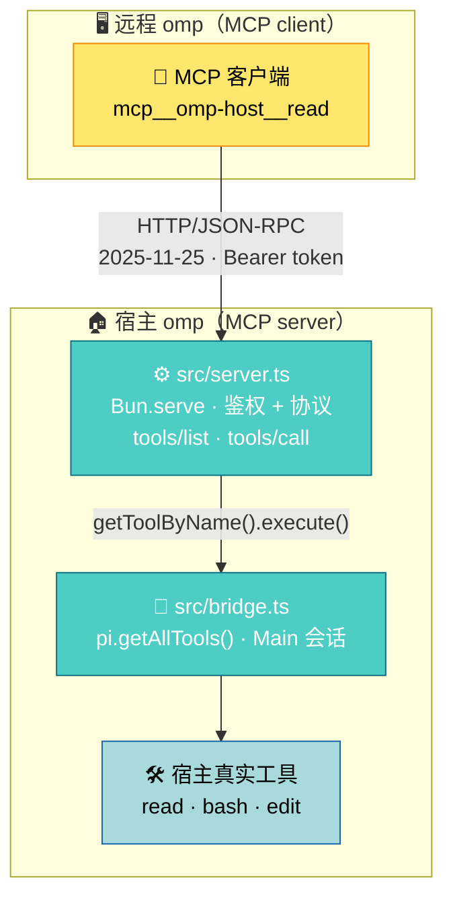

# omp A2A Bridge

[English](README.md) | 简体中文

这个扩展在宿主 `session_start` 时起一个 MCP 服务器接口（MCP `2025-11-25`，Streamable HTTP，默认只绑 `127.0.0.1`）。远程 omp 的 `mcp.json` 指向它，即可调用宿主 `Main` 会话里的工具（`read`/`bash`/`edit`…），执行落在宿主真实的文件与 shell 上。宿主不做模型推理——收请求、跑工具、回结果，不消耗 token。

## 工作原理



- 扩展在 `session_start` 时启动 `Bun.serve`，实现 MCP `2025-11-25` 的 `initialize` / `tools/list` / `tools/call`，响应为纯 JSON（无 SSE）。
- 工具目录来自宿主当前会话（`pi.getAllTools()`），执行固定路由到宿主 `Main` 会话的 `getToolByName`，因此走的是宿主原生工具实现。
- 目录就是宿主注册表本身，桥不过滤（见「安全与边界」）。
- 远程调用不经过任何模型推理：宿主只做「收请求 → 跑工具 → 回结果」。

## 安装

任意机器上，从 git URL 装：

```sh
omp install https://github.com/adam-ikari/pi-a2a-ext.git
```

它会装到 `~/.omp/plugins/node_modules/pi-a2a-ext`。卸载：

```sh
omp plugin uninstall pi-a2a-ext
```

已有本地 checkout 的话，在仓库根执行 `omp install .` 直接链本地这份（开发时方便），
不会去拉远端。`package.json` 里的 `pi.extensions` 字段就是告诉 omp 该加载哪个入口
文件的，**不要删掉它**。

`omp install` 接受的是**目录或 git URL，不接受 `.tgz`**——指向 tarball 会报
`ENOTDIR`；GitHub 的 `owner/repo` 简写会被当作非法包名拒绝，要用完整的
`https://….git` URL。

上面这些是实测过的。**但 `omp install <git-url>` 的端到端（真机装 → 起宿主 → MCP 握手）目前没有自动化核验**——宿主解析插件目录不受 `HOME` 隔离影响，模拟新机器的探针一直在验真实环境里那份旧安装。`bun run test:install` 现在只核验发布包自身是否自包含（manifest、`files[]`、入口的相对 import 图）。见 [docs/testing.md](docs/testing.md)。

若想绕开插件管理器，`./scripts/install.sh` 直接软链到 `~/.omp/agent/extensions/`，
并额外校验软链可解析、且入口 import 的模块齐备。它支持 `--status`（只报告状态，
坏了非零退出）与 `--uninstall`；要装到 `~/.omp/agent` 以外的位置，设 `OMP_AGENT_DIR`。

> 这些方式都**不要**用 `ln -s "$PWD/extensions/a2a-bridge.ts" ...` 代替。那条命令
> 只在 `$PWD` 恰好是仓库根目录时有效；换个目录执行就会链到一个不存在的路径，桥静默
> 地不启动。

首次启动时桥会在 `~/.omp/agent/` 下自行生成配置、token 与文件沙箱，所以每台机器
无需额外配置。

启动宿主 omp 后，通知栏显示：

```
A2A bridge listening on http://127.0.0.1:<port> (token <前6字符>…)
```

`<port>` 是实际监听端口（默认随机）。

## 配置

配置文件 `~/.omp/agent/a2a-bridge.json`，首次启动自动生成，权限 `0600`（创建时即 0600，无权限窗口）：

```json
{ "port": 0, "token": "<base64url 32B>", "host": "127.0.0.1" }
```

| 字段 | 含义 |
| --- | --- |
| `port` | `0` = 随机端口；写具体数字则固定 |
| `token` | Bearer token，首次启动自动生成 |
| `host` | 监听地址，默认 `127.0.0.1`（改成 `0.0.0.0` 会额外告警） |

只有这三个字段。**没有工具白名单或黑名单，没有文件沙箱**——桥不替宿主做权限决定，配置里加这些字段不会生效（多余字段被忽略）。

环境变量 `A2A_BRIDGE_CONFIG` 可覆盖配置文件路径；`A2A_BRIDGE_AUDIT` 可覆盖审计日志路径。

校验是 **fail-closed** 的：字段类型非法（`port` 非整数/越界、`host` 非非空字符串）时扩展拒绝启动并报错。唯一的例外是 `token`：缺失或非法时自动生成并**写回配置**，保证跨重启稳定。

配置文件的改动在**下次重启宿主**后生效；运行中只想换 token 用 `/a2a rotate`（立即生效，旧 token 即刻作废）。

### 命令

宿主会话内：

- `/a2a` — 显示当前监听地址、端口、token 前缀、文件沙箱根与大小上限（沙箱不可用时显示 `files disabled`）
- `/a2a rotate` — 轮换 token（写完配置后需同步更新远程 `mcp.json`）
- `/a2a token` — 打印完整 token（状态行只显示前缀）

## 远程连接示例

远程 omp 的 `mcp.json`：

```json
{
  "mcpServers": {
    "omp-host": {
      "type": "http",
      "url": "http://127.0.0.1:<port>/",
      "headers": { "Authorization": "Bearer <token>" }
    }
  }
}
```

连上后远程侧会看到 `mcp__omp-host__read`、`mcp__omp-host__bash` 之类的工具，直接调用即可。

## 跨机转发

默认只绑回环，不对外网开放。远程机做 SSH 端口转发：

```sh
ssh -L <localport>:127.0.0.1:<port> user@host
```

`mcp.json` 的 `url` 写 `http://127.0.0.1:<localport>/`。

## 审批

远程调用完全复用宿主的审批门（`ExtensionToolWrapper`），不额外开权限：

- 宿主默认 `approvalMode` 为 `yolo` → 直通，没有审批环节。
- 若宿主把某个工具在 `tools.approval` 配成 `prompt`，且宿主有交互 UI（TUI），远程调用会弹 Approve/Deny，用户确认后继续，结果原路返回。
- 宿主无交互 UI 时（rpc 模式实测；print 同为无 UI 路径，未实测），`prompt` 类审批**不会执行命令，但也不返回**：请求一直挂起（实测 ≥90s），宿主在等一个永远不会出现的 UI 应答。**调用方必须自设超时**；挂起的调用会在审计日志留下 `start` 记录而无配对的 `done`（见下），可据此发现。

## 文件传输

桥不自带文件工具。要在两台机器间搬文件，走宿主自己的工具（远程侧看到的是 `mcp__omp-host__read`、`mcp__omp-host__bash` 等），大件走 SSH：

```sh
scp ./data.tar user@host:~/data.tar
```

桥不设 `fileRoot`、不设 `deny`、不解释路径——执行落在宿主真实的文件与 shell 上，权限由宿主自己的配置决定（见「安全与边界」）。

## 安全与边界

- **token 即工具执行全权（默认配置下）**：宿主默认 `approvalMode: yolo`，拿到 token 就可在宿主会话里直接执行任意暴露的工具（含 `bash`），不经过任何审批；只有宿主把工具配成 `prompt` 才有审批门可拦（无 UI 时见审批节）。配置文件保持 `0600`，不要进版本库。
- **桥不做权限决定**：`tools/list` 就是宿主会话的注册表（`pi.getAllTools()`），原样透传，不过滤。因此它包含 `hidden` 工具、也包含宿主当前对自己模型禁用的工具——**omp 是什么权限，桥就是什么权限**。桥没有 `deny` 这类第二套名单：两份名单可以互相矛盾，而代码里没有定义谁优先。要收紧就配宿主自己的工具权限，桥不参与。
- **执行走宿主原生工具**：`tools/call` 固定路由到宿主 `Main` 会话的 `getToolByName().execute()`，注入真实的 `session.settings` 与 `ExtensionContext ui`，所以宿主的审批门（`ExtensionToolWrapper`）照常生效，桥自己一套审批逻辑都没有。
- **调用与列表同源**：`tools/call` 只接受出现在 `tools/list` 里的名字，别名（如 `xd://bash`）和未注册的名字一律拒绝，且不区分「被过滤」与「不存在」（不泄露名字是否存在）。
- 默认仅回环监听；真要对外暴露，防火墙自己负责。
- **会话强制**：除 `initialize` 外所有消息必须携带 `Mcp-Session-Id`（缺失 → 400，未知/空闲超 24h → 404）。会话上限 64 个，超出淘汰最久未用；每次命中刷新空闲计时。
- **审计日志**：每次远程 `tools/call` 写两条 JSONL——发起时 `{ts,id,sid,phase:"start",tool,args}`，完成时 `{ts,id,sid,phase:"done",tool,isError,args}`（同 `id` 配对；`sid` 为该调用的 `Mcp-Session-Id`，共享 token 下可把调用归因到客户端会话；参数摘要截断 1KB）到 `~/.omp/agent/a2a-bridge.log`，权限 0600，超过 512KB 轮转为 `.1`。**只有 `start` 没有 `done` = 调用已发起但未完成**（典型：无 UI 下挂起的审批）；轮转恰逢中途时，配对的两条可能分处 `.1` 与当前文件。日志写失败不影响调用。参数里超过 120 字符的字符串只记 `<len:N,sha256:前8位>`，日志不落载荷。
- 端口被占用时回退到随机端口并告警（远程 `mcp.json` 需同步改端口）。

与 computer use（看屏幕猜坐标点按）的差别见 [docs/computer-use.md](docs/computer-use.md)。

请求/响应格式、处理顺序、会话生命周期与错误码总表的完整 wire 契约见 [docs/protocol.md](docs/protocol.md)。

在线文档站（GitHub Pages，push 自动发布）：<https://adam-ikari.github.io/pi-a2a-ext/>

v1 边界：

- 只暴露工具（`tools/list` + `tools/call`），无 resources、无 prompts。
- 无 SSE 推送，无调用取消。
- 固定路由到宿主 `Main` 会话。
- 静态 Bearer token，无 OAuth。
- 无并发/速率限制。

设计取舍（想加功能前先看这段）：

- 桥只负责把调用送到，不在途中加意思。宿主已有 `read`/`bash`/`edit` 就能表达的能力，不另造工具；不替宿主判断路径；不按权限过滤目录——**omp 是什么权限，桥就是什么权限**。给桥加一份自己的判断，它就成了第二个 omp。
- 桥自带的工具会绕过宿主审批门，因此必然要自带沙箱。**这是一个决定的两个后果，要一起删**：只删沙盒会留下谁都不管的洞。


## 故障排查

- **401 `unauthorized`**：token 不匹配。远程 `mcp.json` 的 `Authorization` 头必须与配置 `token` 一致；`/a2a rotate` 之后要同步改远程侧。
- **400 `missing mcp-session-id` / 404 `unknown session`**：除 `initialize` 外都要带会话头。会话是宿主进程内存态——宿主重启即全部失效、空闲超 24h 也回收；重新 `initialize` 拿新会话即可（正规 MCP 客户端库会自动处理）。
- **连不上 / 端口对不上**：宿主启动时配置端口被占用会回退到随机端口并在通知栏告警——以通知栏或 `/a2a` 显示的实际端口更新 `mcp.json`。
- **调用一直没有返回**：宿主无交互 UI 且该工具审批为 `prompt`（见「审批」）——命令不会执行但也不返回；调用方必须自设超时，审计日志里该调用只有 `start` 没有 `done`（见「安全与边界」的审计日志条目）。
- **500 `internal error`**：服务端内部故障；响应体固定不含细节（防泄露），真实原因在宿主 stderr，形如 `[a2a-bridge] internal error: …`。
- **改了配置不生效**：外部编辑 `a2a-bridge.json`（如 `port`）需重启宿主；运行中只有 `/a2a rotate` 即时生效。
- **`bun test` 版本守卫失败**（开发）：`@oh-my-pi/pi-*` 实装与 pin/lock 失同步——`bun install` 恢复；`omp --version` 与 pin 不一致只告警，升级宿主时同步改 `package.json` 里的两个精确版本号。

## 开发

```sh
bun install

bun run typecheck     # 类型检查
bun run lint          # lint + 格式检查（Biome；修复用 bunx biome check --write .）
bun test              # 单测：test/*.test.ts（协议/鉴权/配置/暴露门/审计/版本守卫）
bun run test:smoke    # 真实 E2E（需本机 omp；不需要模型凭据）
bun run test:hardening # 真实宿主加固核验，29 项（需本机 omp）
bun run test:approval  # 审批边界判别核验，约 95 秒（需本机 omp）
bun run test:install  # 发布包自包含核验，17 项（npm pack + import 图，无需宿主）
./scripts/install.sh # 安装扩展到 ~/.omp/agent/extensions（--status / --uninstall）
bun run website        # 文档站（Docusaurus）本地预览 http://localhost:3000；首次先 cd website && bun install
```

各测试的覆盖面、真实宿主核验的前置条件与判读标准（含审批核验 VERDICT A/B/C 语义）见 [docs/testing.md](docs/testing.md)。

依赖说明：`@oh-my-pi/pi-coding-agent` 与 `@oh-my-pi/pi-ai` 以**精确版本**固定在 `devDependencies`，与宿主 omp 版本保持一致，仅用于类型检查与单测。**运行时不要从 `node_modules` 加载它们**——宿主 omp 的 `omp:legacy-pi-shim` 会把这些 import 重定向到宿主内嵌的同一份模块，`AgentRegistry.global()` 这类模块级单例才能共享；升级 omp 时同步改这两个版本号；`bun test` 内置**版本守卫**：实装 devDep ≠ pin 直接失败，`omp --version` ≠ pin 时告警。

文件布局：

| 路径 | 职责 |
| --- | --- |
| `extensions/a2a-bridge.ts` | 扩展入口，`session_start` 起服务器，注册 `/a2a` |
| `src/server.ts` | `Bun.serve` + JSON-RPC（MCP 2025-11-25，纯 JSON 响应）、会话与版本协商 |
| `src/bridge.ts` | 工具目录与执行（`pi.getAllTools` / AgentRegistry Main 会话）、暴露交集判定 |
| `src/config.ts` | 配置加载/保存、字段校验、token 生成 |
| `src/auth.ts` | Bearer token 校验（timing-safe 比较） |
| `src/audit.ts` | 远程调用审计日志（JSONL 两阶段 `start`/`done`，轮转） |

变更历史见 [CHANGELOG.md](CHANGELOG.md)。

## 许可

MIT，见 [LICENSE](LICENSE)。
