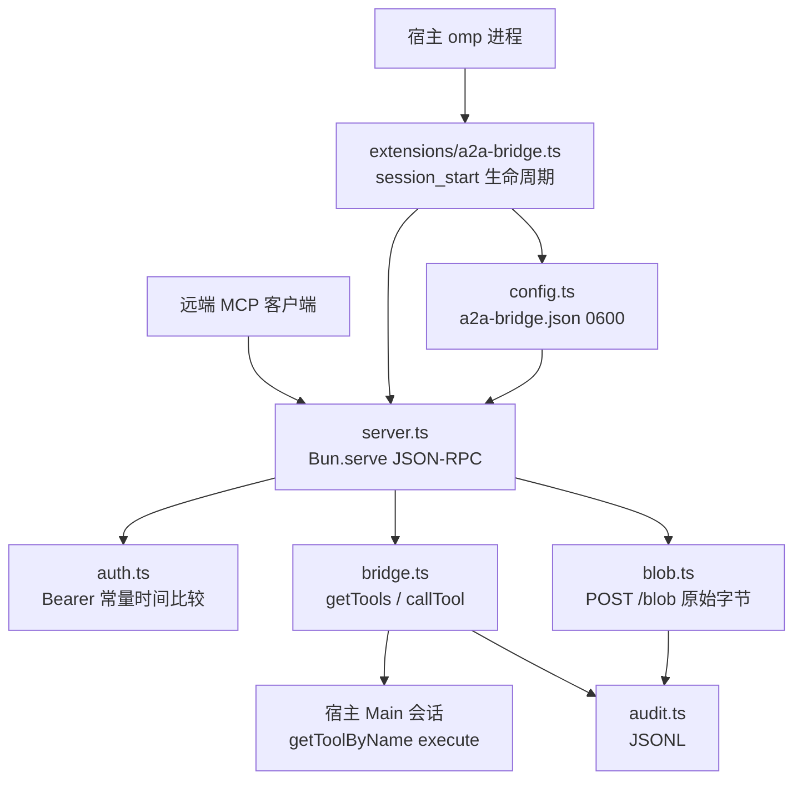

# System architecture

## Overview

一个进程，跑在宿主 omp 内部：扩展在 `session_start` 时起 `Bun.serve`，`session_shutdown` 时停。872 行 TypeScript，**零运行时依赖**——JSON-RPC 手写，因为 MCP SDK 在这台机器上哪儿都没装。

行数是当前值，随改动变；这里记的是分工。

| 模块 | 行 | 职责 |
| --- | --- | --- |
| `extensions/a2a-bridge.ts` | 83 | 生命周期与 `/a2a` 命令；组装 `BridgeDeps`；启动失败不留半初始化状态（否则 `/a2a rotate` 会为一个从没绑定的服务器报成功） |
| `src/server.ts` | 255 | JSON-RPC over `Bun.serve`：鉴权 → 会话 → 路由。`POST /blob` 在读 body 之前分流 |
| `src/bridge.ts` | 149 | `tools/list` 目录 = `pi.getAllTools()` 原样；`tools/call` 落到宿主 `getToolByName().execute()` |
| `src/blob.ts` | 143 | 原始字节上传；自己解析路径；写完审计 |
| `src/audit.ts` | 127 | 两阶段 JSONL 审计 + `blob:write`；参数脱敏；512 KB 轮转 |
| `src/config.ts` | 99 | `a2a-bridge.json`（只有 `port` / `host` / `token`），fail-closed 校验，0600 |
| `src/auth.ts` | 16 | Bearer + `timingSafeEqual` |

宿主 API 只有三处入口，全在 `bridge.ts`：`AgentRegistry.global().get(MAIN_AGENT_ID)`、`session.getToolByName()`、`pi.getAllTools()`。注入的是真实 `session.settings` 与 `ExtensionContext ui`——这样宿主的 `ExtensionToolWrapper` 审批门照常生效，**桥自己一套审批逻辑都不实现**。

## Module graph

桥自己贡献的工具是零个——`tools/list` 里 21 个全部来自宿主注册表。

## Constraints

- **零运行时依赖。** `@oh-my-pi/*` 只在 devDependencies，由宿主 `omp:legacy-pi-shim` 在运行时重定向到宿主内嵌副本。运行时依赖它等于 fork 掉 registry（`AgentRegistry.global()` 是模块级 static），`tools/call` 会看不见 Main 会话
- **pin == 宿主版本。** 扩展对着那个版本做类型检查，`test/versions.test.ts` 硬断言 installed == pin。复发过五次，见 `roadmap` 那条未决线程
- **单进程、在宿主内。** 走 stdio 会与运行中的 TUI 抢 stdin/stdout，且 TUI 审批转发需要同进程
- **请求体上限 128 MB**（`maxRequestBodySize`）。Bun 在 handler 之前缓冲，所以代价是**每个在途请求**的内存，不是预分配
- **包必须自包含**：`version` + `pi.extensions` + `files: ["extensions/", "src/"]`。少 `files[]` 里的模块会「装得上、加载时才炸」
- **500 不泄露宿主内部。** 路径与堆栈只进服务端日志，响应体是固定的 `internal error`
