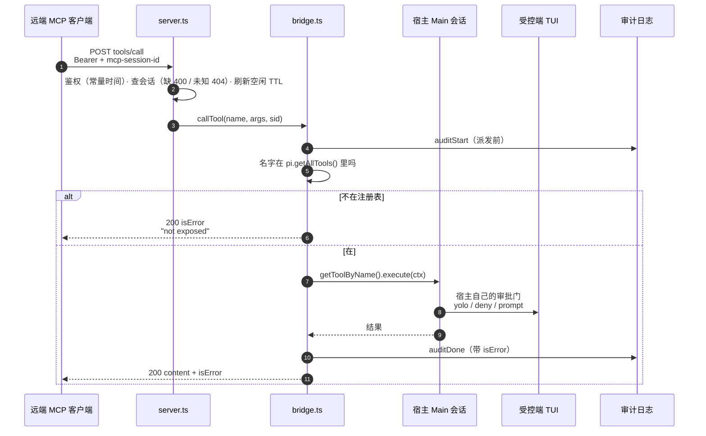
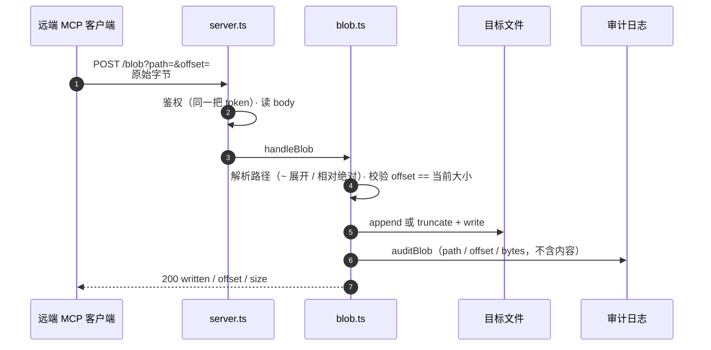

# Key flows

## End-to-end path of a typical request

一次远程 `tools/call`。这张图的重点不是「转发」，而是**转发之前和之后各有几道闸**——鉴权、会话、暴露面、审批，四道都不在桥的判断范围内，各自有各的主人。

工具抛错也走 200 + `isError`——工具被拒不等于 HTTP 出错。

`ctx` 里注入的是真实的 `session.settings` 与 `ExtensionContext ui`，所以那道审批门是**宿主**的，桥只是把调用送到它面前。

## Other important flows

**`POST /blob`——另一扇门，同一把锁**

这条路径**不过宿主审批门**，路径也由桥自己解析——`ExtensionAPI` 只有 `on("tool_approval_requested")`，扩展无法主动发起审批。代价写在 `docs/protocol.md`「它放弃了什么」。审计与鉴权都还在：它是同一间屋子的第二扇门，不是没锁的门。

**首次启动** — `loadConfig()` 读 `~/.omp/agent/a2a-bridge.json`（`$A2A_BRIDGE_CONFIG` 可改路径）。文件不存在就用默认 `port: 0` + 新 token 写一份 0600；`port`/`host` 存在但格式错则**拒绝启动**（fail-closed），只有 `token` 会自愈并立刻落盘，免得远端每次重启都换 token。端口被占用时退回临时端口并在 TUI 告警——远端 `mcp.json` 钉的是旧端口。

**会话生命周期** — `initialize` 发新 `Mcp-Session-Id`，协议版本恒答 `2025-11-25`（不回显客户端要的那个，否则等于接受任何版本）。之后每条消息（含 notification）都必须带该头：缺 400，未知或空闲超 24h 404，命中即刷新 TTL。map 上限 64，满了淘汰最久未见——被丢掉的客户端不会回来。`DELETE` 可结束会话，鉴权在它之前。

**审批挂起** — 无 UI 且策略要求 prompt 时，请求**挂住**（实测 ≥90s），不是 `isError`。副作用不会发生，但协议层没有答案。调用方必须自设超时；审计里留下一条 `start` 没有 `done`，挂起因此可见。

**`/a2a` 命令** — 无参显示地址与 token 前六位；`rotate` 重新生成并落盘（远端要改 `mcp.json`）；`token` 显示完整 token。服务器没起来时报「not running」而不是假装成功。
