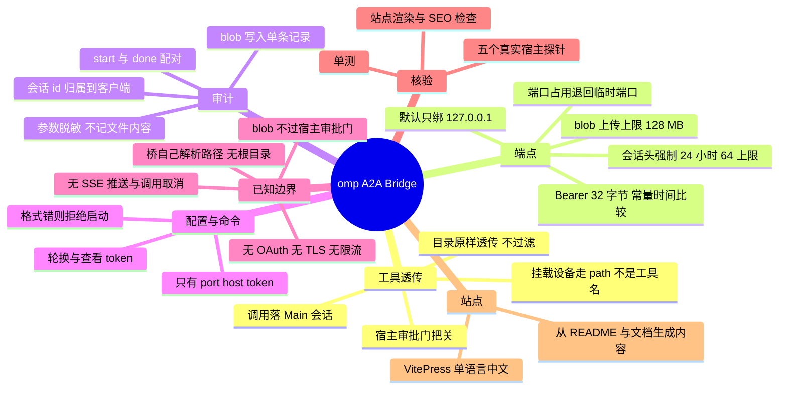

# Feature mindmap

## Feature mindmap

```mermaid
mindmap
  root((omp A2A Bridge))
    工具透传
      目录原样透传 不过滤
      调用落 Main 会话
      宿主审批门把关
      挂载设备走 path 不是工具名
    端点
      默认只绑 127.0.0.1
      Bearer 32 字节 常量时间比较
      会话头强制 24 小时 64 上限
      blob 上传上限 128 MB
      端口占用退回临时端口
    审计
      start 与 done 配对
      会话 id 归属到客户端
      blob 写入单条记录
      参数脱敏 不记文件内容
    配置与命令
      只有 port host token
      格式错则拒绝启动
      轮换与查看 token
    已知边界
      blob 不过宿主审批门
      桥自己解析路径 无根目录
      无 OAuth 无 TLS 无限流
      无 SSE 推送与调用取消
    核验
      单测
      五个真实宿主探针
      站点渲染与 SEO 检查
    站点
      VitePress 单语言中文
      从 README 与文档生成内容
```

根是桥本身，往下是它真正在做的六件事，加一支「已知边界」——那支不是功能，是**按决定承担的代价**，放在这里是为了下次有人看到 `POST /blob` 时不必重新推一遍。
