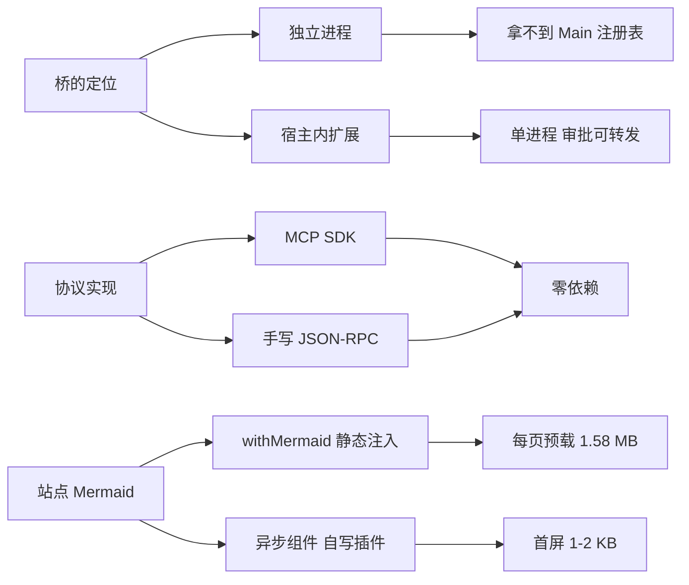

# Tech stack

## Technology choices

| domain | candidates | decision | rationale |
| --- | --- | --- | --- |
| 宿主集成 | 独立进程 / 扩展 API | **扩展**，在 `session_start` 内起 `Bun.serve` | 单进程同宿主，`Main` 注册表可达；stdio 会与运行中的 TUI 抢 stdin/stdout，且审批转发需要同进程 |
| 传输 | stdio / SSE / Streamable HTTP | **Streamable HTTP** `2025-11-25`，默认 `127.0.0.1` | 实测宿主客户端接受 plain JSON 响应；GET SSE 可选（405 容忍） |
| MCP 实现 | 装 MCP SDK / 手写 JSON-RPC | **手写**，零运行时依赖 | SDK 在这台机器上哪儿都没装；桥总共四个方法，不值一个依赖 |
| 运行时 | Node / Bun | **Bun 1.3.14** | 宿主本身就是 Bun；请求体上限靠 `maxRequestBodySize` |
| 语言与类型 | JS / TypeScript 5.9.3 | **TS** | 对宿主 SDK 的 `execute()` context 做类型检查。靠一条空的 `import type {}` 合并 `AgentToolContext` augmentation——删掉它检查会静默退化成空操作 |
| lint / format | ESLint + Prettier / Biome 2.5.14 | **Biome** | 一个工具。`.agents/` 与 `skills-lock.json` 已移出管辖（外部 skill 产物，不是本仓库的责任） |
| 站点 | 手写静态 / VitePress 1.6.x | **VitePress 单语言中文站** + `sync.mjs` | 内容只有一份真相：从 `README_ZN.md` / `CHANGELOG.md` / `docs/**` 生成 `content/` |
| 站点 Mermaid | `withMermaid` / 自写异步组件 | **弃用 `withMermaid`** | 它把 mermaid 静态注入 app entry，于是每页首屏都预载 1.58 MB；改成 `defineAsyncComponent` + 一个 8 行 Vite 插件后是 1–2 KB |
| 测试形状 | 平铺断言 / 叙事场景 | **两者都要**，场景套件从第二条通道验结尾 | 单通道内的推理带着两个 P1 上线过（675 行文件传输面，100 单测全绿）。多写断言不等于多一条通道 |
| 宿主审批档 | `always-ask` / `write` / `yolo` | **三档都测**，`write` 档最有意思 | 实测 `--approval-mode` 只接受这三个值，没有 `deny`（deny 是宿主闸门产生的结果，不是档位）。同一策略对读立刻答、对 bash 挂住——这正是桥不能替它表态的边界 |
| 发布 | npm / git URL | **只 `omp install <git-url>`** | 安装由 omp 保证，桥不给第二条路 |
| 版本管理 | — | **master + `v0.1.0` tag + GitHub Release** | 不发 npm。tag 打出来是为了有个能钉住的版本，不是分发渠道 |

## Decision mindmap

## Open items

- **两种依赖策略并存**：根仓库的 `@oh-my-pi/*` 是精确 pin（对着宿主版本做类型检查），站点的 `vitepress` 是 `^1.6.3`。原因是站点不与宿主耦合，pin 它没有对应的守卫
- **站点没有测试框架**，靠 `website/scripts/render-check.mjs`（34 项）加一次真实浏览器。Mermaid 是客户端渲染，构建通过不等于图能画出来
- **pi-* 的 pin 随宿主升级自动失配**：守卫已从 warn 改成 fail（见 `roadmap`），但它只能告诉你「该同步了」，不能替你同步
- **brain 的 mermaid 图无人渲染校验**。写的时候用站点自带的 mermaid 在 jsdom 下 parse 过，并先反证探针会对坏语法 FAIL；这个校验没接进任何命令，只是手动跑过一次
