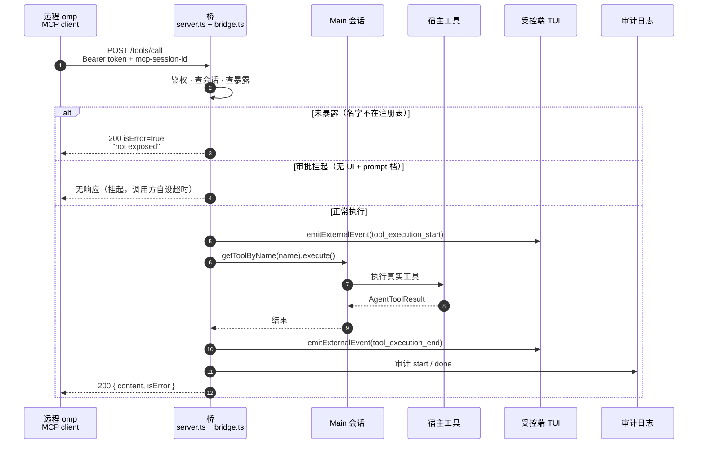

# 协议参考

omp A2A Bridge 实现 MCP（Model Context Protocol）`2025-11-25` 的 Streamable HTTP 子集，所有响应为纯 JSON（无 SSE 流）。权威实现是 [`src/server.ts`](../src/server.ts)；本文与代码冲突时以代码为准。使用侧背景（安装、配置、威胁模型）见 [README](../README.md)。

## 传输

| 项 | 行为 |
| --- | --- |
| 端点 | MCP 侧不校验 URL path，任意路径的 POST/DELETE 均受理；惯例用 `/`（`http://127.0.0.1:<port>/`）。唯一例外是 `/blob`，见「原始字节上传」 |
| POST | 单条 JSON-RPC 2.0 消息；**不支持 batch**（顶层数组 → 400）；请求体上限 128MB（`maxRequestBodySize`，`/blob` 与 MCP 路径共用） |
| GET | `405` 空响应体（不实现 SSE 端点与流式推送） |
| DELETE | 结束会话，见「会话生命周期」 |
| 其他方法（PUT 等） | `405` |
| 响应头 | 一律 `Content-Type: application/json`；`initialize` 额外返回 `mcp-session-id` |
| CORS | 不发送（回环工具，非浏览器场景） |

## 一个进程，一套端口

服务器是**每进程**的资源，而宿主给它的两个事件是**每会话**的：task 子代理、ACP 会话、持久化 revive 都会新建一套 extension runner 并重跑本入口（模块图不重新求值，所以 `server`/`cfg` 是共享的）。入口的职责就是把这两者对上：

- 第一个 `session_start` 绑定端口，之后的 `session_start` 静默复用同一个服务器，不再广播。绑定这一步不是原子的（`loadConfig` 与 `startServer` 都要 await），所以两个 `session_start` 可以同时在途：后到的等前一个绑完，不另起一套。各绑各的会留下一个谁也停不掉的端口，操作者还会收到两条指向不同端口的广播
- 交给宿主执行的工具属于注册表里的 `Main` 会话（每次调用现取），而审批与通知属于**第一个** `session_start` 那份 `ctx`，之后不再换。交互式宿主里那正是主会话；`/task` 子代理的 `ctx` 没有可用 UI，若让它先占住这份引用，写入类调用会一路挂住
- `session_shutdown` 只在宿主注册表里已经没有 `Main` 会话时释放端口。这里的「没有」按 `AgentRef.session` 是不是 `null` 判：宿主把这个字段注释成「Null exactly when parked/aborted」，槽位还在但会话是 `null` 的那种，`tools/call` 本来也只会回一句 `main session not available`，留着端口只是占着一个没人能用的接口。子代理结束（或被 idle-TTL 停泊）会发出这个事件，那时端口照常服务主会话
- 绑定这一步要 await，所以那个事件可能落在端口落地之前：它手里还没有端口，谁也没停，而绑定随后完成，留下的端口服务的是一个已经不存在的 `Main`。绑完之后再按同一条判据看一次注册表，已经没有 `Main` 就把刚绑的端口收掉，一句广播也不发。这条复查不会挡住正常启动：宿主三个模式（tui、rpc、print）都是在会话已经建好之后才发 `session_start`（`runtime-init.ts:212`、`extension-ui-controller.ts:320-329`），那一刻槽位后面的会话是非 null 的
- 主会话结束时这条判断也就没有 `Main` 可看了：交互式宿主的 `session_shutdown` 是进程退出那一步发的（端口随进程释放），会话型宿主在 dispose 里注销注册表条目。核验只看一件事——没有 `Main` 之后端口不再接受连接，有 `Main` 期间端口一直在

## 原始字节上传

`POST /blob` 收原始字节，用来把固件、镜像这类二进制放上宿主机——`tools/call` 做不到，因为它只能传字符串，调用方得先 base64。

```
POST /blob?path=<p>[&offset=<n>]
Content-Type: application/octet-stream
Content-Length: <n>

<原始字节>
```

| 查询参数 | 语义 |
| --- | --- |
| `path` | 必填。`~` 与 `~/x` 按宿主 HOME 展开，相对路径按宿主 agent 目录解析。**不设根目录，不设白名单** |
| `offset` | 省略则追加到文件末尾；给出则必须等于当前文件大小，否则 409。不允许写进文件中部。这个比较在拿到文件句柄之后又做一次：body 读进来要时间，期间文件可能被别的写入长大，显式 `offset` 的调用方说了字节属于哪里，位置变了就整条拒绝，不会把字节放到别处却回报你那个 offset |

响应 `200` 带 `{written, offset, size, path}`。拒绝情形：

| 状态 | 条件 |
| --- | --- |
| `401` | 无 Bearer token（与 MCP 路径同一个 token） |
| `400` | 缺 `path`；body 为空；`offset` 非非负整数 |
| `500` | 打不开或写不进目标（父目录建不出来、`path` 是个目录、权限不够、磁盘满）。这些是操作系统的答复，原样带回并把 `path` 写进消息；目录那种是整条拒绝，不存在「写进去一半」 |
| `409` | `offset` 与当前文件大小不符（打开前后各查一次，第二次针对在途变化） |
| `413` | 请求体超过 128 MB（`maxRequestBodySize`，与 MCP 路径同一个上限）。Bun 在 handler 之前就拒了，所以既不碰文件也不写审计 |
| `405` | `/blob` 只接受 `POST`。`GET` 不会读回文件，`DELETE` 不会删文件——它不会误落进 MCP 的「结束会话」分支 |

每次写入在审计日志里留一条 `tool: "blob:write"` 的记录，args 只有 `path`/`offset`/`bytes`——**文件内容不进日志**。走到 handler 的失败同样记录，`bytes: 0` 加一段错误文本，所以「写了 16 MB」与「试过且没写成」在日志里分得开；被 413 挡在 handler 之外的不记录。磁盘满或配额到顶会让 `write` 短写，那种回 `500` 而不是 `200`，响应带上已经落盘的 `offset`/`size`。

### 没有下载，这是有意的

`/blob` 只做上传。读取仍走宿主工具，而宿主侧有三处限制叠在一起：`read` 单行超 150 KB
直接拒绝、`bash` 输出超 768 字节就截断并指向 `artifact://N`、`read artifact://N`
自己又截断在约 150 KB。加一个 `GET /blob` 能绕过它们，但那意味着桥开始**读**宿主
任意路径——比写更敏感（SSH 私钥、`.env`）。所以这里不做，实测的三个限制原样列出来，
好让客户端知道为什么 `GET` 是 405 而不是「还没做」。

### 内存

`maxRequestBodySize` 是 Bun 在 handler 之前缓冲的上限，所以代价是**每个在途请求**的内存，不是预分配。`test:blob` 每轮实测宿主 RSS 并写进 `test/rss-<宿主版本>.json`（每轮覆盖，表就是文件里那一份，宿主 **18.6.3**，2026-10-09）：

| | 宿主 RSS |
| --- | --- |
| 空闲 | 490 MB |
| 一次 8 MB 上传后（安顿值） | 513 MB（+23 MB） |
| 8 MB × 2 并发后（安顿值） | 650 MB（+160 MB） |

这一轮的在途峰值是 +24 / +264 MB：单个 8 MB 那一次只涨 +23，同一轮里两个并发量到 +264。**这些数字只能当量级看。** 十六个轮次的单个 8 MB 安顿增量依次是 +11、+26、+171、+165、+10、+18、−6、−157、+91、+18、+9、+34、+131、+151、+27、+23 MB，其中两次为负；两个并发那项安顿为 +147、+148、+44、−141、+99、+32、+16、+52、+138、+144、+157、+160 MB，峰值为 +245、+248、+44、−141、+100、+32、+33、+52、+140、+148、+243、+264 MB。连`空闲`基线自己都在动：近六轮依次是 490、567、484、474、461、490 MB，跨度 106 MB。负值出在取样位置上：`空闲`在探针末尾读，那一刻前一步那次 100 MB 上传仍有内存没还给操作系统，基线自己一路往下衰减，于是每个增量量到的是衰减的进度，量不到那一次上传。分布的宽度来自 Bun 分配器（arena 增长，加上延迟归还），跟本桥有没有把 body 留在内存里无关。探针每轮重跑并覆盖那个 json，所以本表是**最近一次实测**，不是稳定值。阈值要对着整个分布设，建在这上面的任何阈值测的都是分配器当天的状态，会在忙碌的 CI runner 上因与桥无关的原因变红。

能确定的是规模：100 MB 一次请求传完（探针每轮打印耗时，本轮 2.5 秒。此前写死的「2–5 秒」没人复核，已删），请求体上限 128 MB，超出是干净的 413。

**并发要保守，理由在上限本身。** 上限是**每个在途请求**各自的，所以十个并发的 100 MB 上传就是十份各自 100 MB 的缓冲——这个算术不用实测。真实峰值取决于 Bun 怎么分配，上面那些数说明不了。要更大的文件就分块：`/blob` 追加到 EOF，分块是一个循环。

### 它放弃了什么

这是这个端点存在的原因，也是它的代价，写在这里以免被当成疏漏：

- **不经宿主审批门。** `tools/call` 的写入走宿主自己的 `write`，因此过审批（`ExtensionToolWrapper`）。这里直接落盘。`ExtensionAPI` 只有 `on("tool_approval_requested", …)`——那是宿主问、扩展答的方向，扩展无法自己发起审批；唯一的近似做法是发一次 `tools/call`，而那正是这个端点要避免的编码。
- **桥自己解释路径。** 宿主有 `resolvePath()` / `expandPath()`，但那是宿主包的内部模块，`BridgeDeps` 里没有任何入口，依赖它们会在宿主移动文件时断掉。所以 `src/blob.ts` 自己实现 `~` 展开与相对/绝对判断——**代价是桥现在能写宿主能写的任何路径**。

README「安全与边界」一节按这个前提写。

### 请求处理顺序

错误按以下顺序**先到先判**（例如「未鉴权 + 缺会话头」返回 401 而非 400）：

1. HTTP 方法（非 POST/DELETE → 405）
2. 鉴权（→ 401）
3. body 解析（→ 400 parse error）
4. JSON-RPC 形状校验（→ 400 invalid request）
5. 会话强制，仅对非 `initialize` 消息（→ 400 / 404）
6. `notifications/*` 前缀 → `202` 空响应体
7. 方法分发（未知方法 → `-32601`）
8. 兜底异常 → 500（细节只进宿主 stderr）

## 鉴权

每个请求（含 `initialize` 与 `DELETE`）在任何状态变更之前校验：

- 头：`Authorization: Bearer <token>`，scheme 大小写不敏感（`/^Bearer\s+(.+)$/i`）。
- 比较为常数时间（先比字节长度）；失败返回 `401`，响应体 `{ "jsonrpc": "2.0", "id": null, "error": { "code": -32000, "message": "unauthorized" } }`。
- 不返回 `WWW-Authenticate` 头。token 来源与轮换见 README「配置」「命令」。

## 会话生命周期

1. `POST initialize`（**不需要**会话头）→ `200`，响应头 `mcp-session-id: <uuid>`。**每次** initialize 都签发一个新会话。
2. 此后的**所有**请求与通知都必须携带 `mcp-session-id: <uuid>`。
3. 每次命中刷新 24 小时空闲计时（TTL 跟踪的是空闲时间）；上限 64 个会话，满时在新 `initialize` 处淘汰最久未见者。
4. 主动结束：已鉴权的 `DELETE` → `204`，幂等（未知或缺失会话头同样 `204`，只是不删任何东西）。
5. 会话是宿主**进程内存态**：宿主重启即全部失效；过期与不存在的会话统一返回 `404 unknown session`。

## 方法

### `initialize`

```json
{ "jsonrpc": "2.0", "id": 1, "method": "initialize", "params": { "protocolVersion": "2025-11-25" } }
```

```json
{
  "jsonrpc": "2.0",
  "id": 1,
  "result": {
    "protocolVersion": "2025-11-25",
    "capabilities": { "tools": {} },
    "serverInfo": { "name": "omp-a2a-bridge", "version": "0.1.0" }
  }
}
```

- `protocolVersion` **恒为** `2025-11-25`：服务器只说一个版本，不回显请求值（请求 `1999-01-01` 也得到 `2025-11-25`）。
- `params` 其余内容被忽略。
- 响应头 `mcp-session-id` 即新会话 id。

### `ping`

→ `200 { "jsonrpc": "2.0", "id": <id>, "result": {} }`。用于存活探测（挂起调用之后服务器仍应答 ping）。

### `tools/list`

→ `200 { "result": { "tools": [ { "name", "description", "inputSchema" } ] } }`

- **无 `nextCursor`**：单页返回全量（宿主 omp 客户端的分页循环在缺省游标时正常终止）。
- `inputSchema` 为 JSON Schema 2020-12（由宿主工具的 typebox schema 经 `toolWireSchema` 导出）。
- 内容 = 宿主会话工具注册表全集（`pi.getAllTools()`），**原样透传不过滤**：含 `hidden` 工具，也含宿主当前对自己模型禁用的工具。桥不贡献任何自己的工具，也不解释权限——语义详见 README「安全与边界」。
- 请求可带 `params.cursor`，被忽略。

### `tools/call`

```json
{ "jsonrpc": "2.0", "id": 2, "method": "tools/call", "params": { "name": "read", "arguments": { "path": "/etc/hostname" } } }
```

三种出口：

1. **成功 / 工具内部拒绝**：一律 `200`，`result = { "content": [...], "isError": <bool> }`。工具抛错（审批拒绝、参数校验失败等）进 `isError`，**不**变成 HTTP 错误。`content` 元素为 `{ "type": "text", "text" }` 或 `{ "type": "image", "data", "mimeType" }`；宿主侧工具结果的类型就只有这两种，第三种（自定义工具绕过类型声明）折成 `text` 的 JSON，桥不把客户端解析不了的内容类型发出去。image 这条路径是真的：`AgentToolResult.content` 的声明就是 text 与 image 两种，宿主 `read` 的文档写明支持图像文件，浏览器截图与图像生成工具也产出 image 块，`data` 是 base64。宿主侧的 `detail`（OpenAI 的分辨率提示）在 MCP 的内容类型里没有对应字段，因此不透传。
2. **未暴露**（不在注册表里，含别名如 `xd://bash`）：`200` + `isError: true`，text 含 `not exposed`。未注册与不存在**共用同一文案**，不泄露名字是否存在。
3. **审批挂起**（宿主无交互 UI 且工具为 `prompt` 档）：**没有响应**——请求会一直挂起（实测 ≥90s）。调用方必须自设超时；审计日志留 `start` 无 `done`。详见 README「审批」。

补充：

- `arguments` 原样透传给宿主工具执行（在宿主 `Main` 会话上下文中）。桥自己的日志把超过 120 字符的字符串折成 `<len:N,sha256:前8位>`，**逐层折到叶子**，宿主 `edit` 的正文落在 `args.edits[0].oldText`（第三层）也在覆盖范围内；宿主会话收到的还是原参数，宿主的记录不由本桥管。
- 每次 `tools/call`（包括被拒绝的）都写一对审计记录，见 README「审计日志」。日志有两处读者容易踩空的地方，`test:hardening` 第 9b 组实测过：其一，记录里的 `id` 是本桥为配对生成的 UUID，**不是**调用方发来的 JSON-RPC id，所以按 JSON-RPC id 查日志查不到任何东西；其二，轮转只保留一代（过 512 KB 就把当前文件改名成 `.1`，下一代再把 `.1` 覆盖掉），因此日志是一份滚动窗口：后续调用把它推过两代，一次挂起的 `start` 证据就从两个文件里同时消失。用日志判挂起，要在轮转窗口内读，且要把 `.1` 与当前文件一起看。
- `params.name` 缺失按空串处理（走向出口 2）。

下面的时序图是 `tools/call` 的一次完整往返，含受控端 TUI 的显示与审计：



图上那两条 `emitExternalEvent` 只管渲染：受控端的 TUI 因此把一次远程调用画成与本地调用相同的卡片，同样的开始/结束生命周期。它们不参与返回值判定。宿主若不接受这个事件（会话形状来自另一个版本、事件总线的入口不是函数），桥照常执行工具、照常把工具自己的结果与错误文本交给调用方。这两个调用此前坐在判定结果的那个 `try` 里，于是渲染失败能让一次已经落盘的 `edit` 报成失败，也能把工具真正的错误换成渲染自身的错误；调用方按 `isError` 重试，就重复执行了一次带副作用的写。

`toolCallId` 每次调用新生成（UUID），不复用调用方的 JSON-RPC id：宿主按 id 渲染卡片，复用会把两次远程调用合成一张。

### `notifications/*`

方法名以 `notifications/` 开头（如 `notifications/initialized`）→ `202` 空响应体。仍需通过会话强制（缺头 400 / 未知 404）。

### 未知方法

→ **HTTP 200** + `{ "error": { "code": -32601, "message": "method not found" } }`（注意是 200，不是 404）。

### 无 id 消息

严格 JSON-RPC 中无 `id` 即通知、不应有响应；本服务器只认 `notifications/` 前缀——其他无 id 消息会得到 `id: null` 的响应。客户端应按规范用 `notifications/` 发通知。

## 错误码总表

| HTTP | JSON-RPC `code` | `message` | 触发条件 |
| --- | --- | --- | --- |
| 401 | -32000 | `unauthorized` | 缺失/错误的 Bearer token |
| 400 | -32700 | `parse error` | body 不是合法 JSON |
| 400 | -32600 | `invalid request` | batch 数组、`jsonrpc` ≠ `"2.0"`、`method` 非字符串、非对象 body |
| 400 | -32000 | `missing mcp-session-id` | 非 `initialize` 消息未带会话头（请求与通知同样处理） |
| 404 | -32000 | `unknown session` | 会话不存在或空闲超 24h（过期条目顺带清理） |
| 405 | — | （空体） | GET 或非 POST/DELETE 方法 |
| 500 | -32603 | `internal error` | 服务器内部异常；**响应体固定为该文案**，细节只打到宿主 stderr（`[a2a-bridge] internal error:`） |
| 200 | -32601 | `method not found` | 未实现的方法 |
| 200 | （result） | `isError: true` | 工具侧拒绝 / 未暴露（text 含 `not exposed`） |

所有错误响应体形如 `{ "jsonrpc": "2.0", "id": <id 或 null>, "error": { "code", "message" } }`。

## 客户端接入时序

1. `POST initialize` → 记下响应头 `mcp-session-id`。
2. （可选）`POST notifications/initialized` → 202。
3. `POST tools/list` / `POST tools/call`，都带 `Authorization` 与 `mcp-session-id` 两个头。
4. **每次调用设置超时**（审批挂起时唯一能解开客户端的手段；用审计日志判定挂起）。
5. 退出时 `DELETE`（可选，释放会话槽位）。

与宿主 omp 自带 MCP 客户端实测兼容（协议 `2025-11-25`、纯 JSON 响应、initialize 后自动附带会话头）。远端跨机场景用 SSH 转发，见 README「跨机转发」。

## v1 未实现面

resources、prompts、SSE 推送、调用取消、并发/速率限制、OAuth/TLS——完整边界见 README「v1 边界」。

