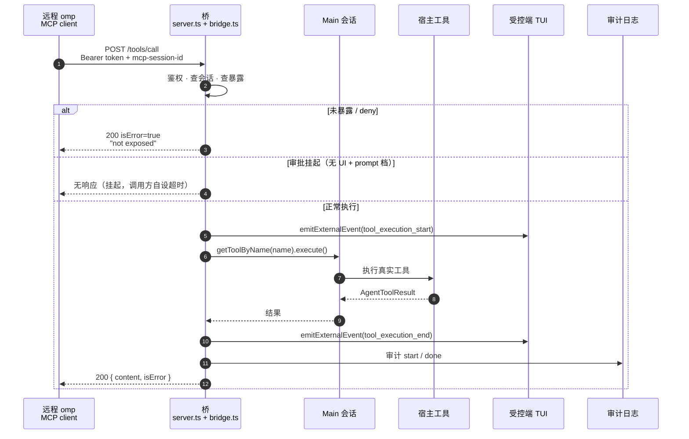

# 协议参考

omp A2A Bridge 实现 MCP（Model Context Protocol）`2025-11-25` 的 Streamable HTTP 子集，所有响应为纯 JSON（无 SSE 流）。权威实现是 [`src/server.ts`](../src/server.ts)；本文与代码冲突时以代码为准。使用侧背景（安装、配置、威胁模型）见 [README](../README.md)。

## 传输

| 项 | 行为 |
| --- | --- |
| 端点 | 服务器不校验 URL path，任意路径的 POST/DELETE 均受理；惯例用 `/`（`http://127.0.0.1:<port>/`） |
| POST | 单条 JSON-RPC 2.0 消息；**不支持 batch**（顶层数组 → 400）；请求体上限 1MB |
| GET | `405` 空响应体（不实现 SSE 端点与流式推送） |
| DELETE | 结束会话，见「会话生命周期」 |
| 其他方法（PUT 等） | `405` |
| 响应头 | 一律 `Content-Type: application/json`；`initialize` 额外返回 `mcp-session-id` |
| CORS | 不发送（回环工具，非浏览器场景） |

### 请求处理顺序

错误按以下顺序**先到先判**（例如「未鉴权 + 缺会话头」返回 401 而非 400）：

1. HTTP 方法（非 POST/DELETE → 405）
2. 鉴权（→ 401）
3. body 解析（→ 400 parse error）
4. JSON-RPC 形状校验（→ 400 invalid request）
5. 会话强制，仅对非 `initialize` 消息（→ 400 / 404）
6. `notifications/*` 前缀 → `202` 空响应体
7. 方法分发（未知方法 → `-32601`）
8. 兜底异常 → 500（细节只进宿主 stderr）

## 鉴权

每个请求（含 `initialize` 与 `DELETE`）在任何状态变更之前校验：

- 头：`Authorization: Bearer <token>`，scheme 大小写不敏感（`/^Bearer\s+(.+)$/i`）。
- 比较为常数时间（先比字节长度）；失败返回 `401`，响应体 `{ "jsonrpc": "2.0", "id": null, "error": { "code": -32000, "message": "unauthorized" } }`。
- 不返回 `WWW-Authenticate` 头。token 来源与轮换见 README「配置」「命令」。

## 会话生命周期

1. `POST initialize`（**不需要**会话头）→ `200`，响应头 `mcp-session-id: <uuid>`。**每次** initialize 都签发一个新会话。
2. 此后的**所有**请求与通知都必须携带 `mcp-session-id: <uuid>`。
3. 每次命中刷新 24 小时空闲计时（TTL 跟踪的是空闲时间）；上限 64 个会话，满时在新 `initialize` 处淘汰最久未见者。
4. 主动结束：已鉴权的 `DELETE` → `204`，幂等（未知或缺失会话头同样 `204`，只是不删任何东西）。
5. 会话是宿主**进程内存态**：宿主重启即全部失效；过期与不存在的会话统一返回 `404 unknown session`。

## 方法

### `initialize`

```json
{ "jsonrpc": "2.0", "id": 1, "method": "initialize", "params": { "protocolVersion": "2025-11-25" } }
```

```json
{
  "jsonrpc": "2.0",
  "id": 1,
  "result": {
    "protocolVersion": "2025-11-25",
    "capabilities": { "tools": {} },
    "serverInfo": { "name": "omp-a2a-bridge", "version": "0.1.0" }
  }
}
```

- `protocolVersion` **恒为** `2025-11-25`：服务器只说一个版本，不回显请求值（请求 `1999-01-01` 也得到 `2025-11-25`）。
- `params` 其余内容被忽略。
- 响应头 `mcp-session-id` 即新会话 id。

### `ping`

→ `200 { "jsonrpc": "2.0", "id": <id>, "result": {} }`。用于存活探测（挂起调用之后服务器仍应答 ping）。

### `tools/list`

→ `200 { "result": { "tools": [ { "name", "description", "inputSchema" } ] } }`

- **无 `nextCursor`**：单页返回全量（宿主 omp 客户端的分页循环在缺省游标时正常终止）。
- `inputSchema` 为 JSON Schema 2020-12（由宿主工具的 typebox schema 经 `toolWireSchema` 导出）。
- 内容 = 宿主会话工具注册表全集减 `deny`（含 `hidden` 工具；`denyMCPTools: true` 时排除 `mcp__` 前缀），**后接桥自带的 `a2a_file_*` 工具**（见「桥自带工具」），同样受 `deny` 约束。语义详见 README「安全与边界」。
- 与宿主工具同名时**宿主优先**：桥的自带工具被摘掉，宿主 stderr 打一条告警（`a2a-bridge] host tool '...' shadows`）。
- 请求可带 `params.cursor`，被忽略。

### `tools/call`

```json
{ "jsonrpc": "2.0", "id": 2, "method": "tools/call", "params": { "name": "read", "arguments": { "path": "/etc/hostname" } } }
```

三种出口：

1. **成功 / 工具内部拒绝**：一律 `200`，`result = { "content": [...], "isError": <bool> }`。工具抛错（审批 deny、参数校验失败等）进 `isError`，**不**变成 HTTP 错误。`content` 元素为 `{ "type": "text", "text" }` 或 `{ "type": "image", "data", "mimeType" }`。
2. **未暴露**（被 `deny` 或不在目录中，含别名如 `xd://bash`）：`200` + `isError: true`，text 含 `not exposed`。被 deny 与不存在**共用同一文案**，不泄露名字是否存在。
3. **审批挂起**（宿主无交互 UI 且工具为 `prompt` 档）：**没有响应**——请求会一直挂起（实测 ≥90s）。调用方必须自设超时；审计日志留 `start` 无 `done`。详见 README「审批」。

补充：

- `arguments` 原样透传给宿主工具执行（在宿主 `Main` 会话上下文中）。
- 每次 `tools/call`（包括被拒绝的）都写一对审计记录，见 README「审计日志」。
- `params.name` 缺失按空串处理（走向出口 2）。

下面的时序图是 `tools/call` 的一次完整往返，含受控端 TUI 的显示与审计：



### 桥自带工具：文件传输

桥自己贡献 6 个工具，走同一条 `tools/list` / `tools/call` 管线（因此复用鉴权、会话、`deny` 门禁与两阶段审计），线格式采用 A2A FilePart 的 `{ name, mimeType, bytes(base64) }`。所有 `path` 都相对配置项 `fileRoot`（沙箱根），**不**是宿主文件系统路径。

| 工具 | 输入 | 成功返回（`content[0].text` 的 JSON） |
| --- | --- | --- |
| `a2a_file_put` | `path`, `file{bytes, mimeType?, name?}`, `overwrite?` | `path, bytes, sha256, mimeType` |
| `a2a_file_put_start` | `path`, `totalBytes?`, `mimeType?`, `overwrite?` | `transferId, chunkMaxBytes` |
| `a2a_file_put_chunk` | `transferId`, `seq`, `bytes` | `receivedBytes, nextSeq, duplicate?` |
| `a2a_file_put_end` | `transferId` | `path, bytes, sha256, mimeType` |
| `a2a_file_get` | `path`, `offset?`, `limit?` | `path, offset, bytes, totalBytes, eof, sha256` |
| `a2a_file_list` | `path?`（默认 `.`）, `limit?`（默认 100） | `entries[{path, bytes, mtime}], truncated` |

- 成功：`isError: false` + 单个 text 块 = `{"ok":true, ...}`。
- 失败：`isError: true` + text = `a2a_file_error <code>: <message>`，`<code>` 是稳定枚举：`invalid_path` `escapes_root` `symlink_refused` `not_found` `is_a_directory` `already_exists` `too_large` `bad_base64` `bad_chunk_order` `unknown_transfer` `size_mismatch` `io_error`。
  - 任何失败都带 code，**没有裸 errno**：`io_error` 是兜底码，表示宿主文件系统拒绝了该操作（`ENOTDIR`/`EISDIR`/`ENOSPC` 等），message 为固定文案、**不含宿主路径**（细节只进宿主 stderr 的 `[a2a-bridge] file tool error:`）。因此 `a2a_file_error <code>` 前缀可作为可靠的解析锚点。
  - `a2a_file_get` 的 `sha256` 是**本次返回区间**的摘要（不是整文件），`totalBytes` 仍是整文件大小——按页校验用 `sha256`，翻页判断用 `totalBytes`/`eof`。
- 尺寸上限：内联与单块解码后 ≤ 512KiB（留在 1MB 请求体上限内），单次 `get` 响应 ≤ 256KiB（用 `offset`/`totalBytes`/`eof` 翻页），单文件 ≤ `maxFileBytes`（默认 100MB）。100MB 约需 200 次 `put_chunk`。
- 分块传输状态在桥进程内，绑定签发它的 `Mcp-Session-Id`：换会话调用同一 `transferId` 得到 `unknown_transfer`（与「不存在」同文案，不泄露他人传输是否存在）。空闲 30 分钟的传输会被后续任一次文件工具调用回收（惰性清理，无定时器），并发上限 16。
- **重传是幂等的**：同一个 `seq` + 同一份 `bytes` 再次到达时按已收处理，返回当前 `receivedBytes`/`nextSeq` 并带 `duplicate: true`，不重复追加——README 要求调用方自设超时，超时重试是常规动作，不该损坏上传。同一 `seq` 换内容则是 `bad_chunk_order`。同一 transfer 的变更步骤（`put_chunk`/`put_end`）串行执行，并发同 seq 不会双写；乱序 `seq` 被拒而非被吸收。**排队中的步骤会在动手前重验 transfer 仍在册**：若期间 `put_end` 已提交并改名走暂存文件，该步骤返回 `unknown_transfer`，不会往死路径写入（那会报成功却丢字节）。因此 `put_end` 提交后再补发 `put_chunk` 一律 `unknown_transfer`。
- **暂存目录不可寻址**：首段为 `.tmp` 的路径一律 `invalid_path`（嵌套的 `sub/.tmp/x` 合法）。否则 `a2a_file_list` 能枚举他人 `transferId`、`a2a_file_get` 能读他人暂存字节、`a2a_file_put` 能改写他人暂存文件，会话绑定形同虚设。
- `a2a_file_put_chunk` **不写逐块审计**（200 块会冲爆日志轮转），start/end 仍全量记录。

### `notifications/*`

方法名以 `notifications/` 开头（如 `notifications/initialized`）→ `202` 空响应体。仍需通过会话强制（缺头 400 / 未知 404）。

### 未知方法

→ **HTTP 200** + `{ "error": { "code": -32601, "message": "method not found" } }`（注意是 200，不是 404）。

### 无 id 消息

严格 JSON-RPC 中无 `id` 即通知、不应有响应；本服务器只认 `notifications/` 前缀——其他无 id 消息会得到 `id: null` 的响应。客户端应按规范用 `notifications/` 发通知。

## 错误码总表

| HTTP | JSON-RPC `code` | `message` | 触发条件 |
| --- | --- | --- | --- |
| 401 | -32000 | `unauthorized` | 缺失/错误的 Bearer token |
| 400 | -32700 | `parse error` | body 不是合法 JSON |
| 400 | -32600 | `invalid request` | batch 数组、`jsonrpc` ≠ `"2.0"`、`method` 非字符串、非对象 body |
| 400 | -32000 | `missing mcp-session-id` | 非 `initialize` 消息未带会话头（请求与通知同样处理） |
| 404 | -32000 | `unknown session` | 会话不存在或空闲超 24h（过期条目顺带清理） |
| 405 | — | （空体） | GET 或非 POST/DELETE 方法 |
| 500 | -32603 | `internal error` | 服务器内部异常；**响应体固定为该文案**，细节只打到宿主 stderr（`[a2a-bridge] internal error:`） |
| 200 | -32601 | `method not found` | 未实现的方法 |
| 200 | （result） | `isError: true` | 工具侧拒绝 / 未暴露（text 含 `not exposed`） |

所有错误响应体形如 `{ "jsonrpc": "2.0", "id": <id 或 null>, "error": { "code", "message" } }`。

## 客户端接入时序

1. `POST initialize` → 记下响应头 `mcp-session-id`。
2. （可选）`POST notifications/initialized` → 202。
3. `POST tools/list` / `POST tools/call`，都带 `Authorization` 与 `mcp-session-id` 两个头。
4. **每次调用设置超时**（审批挂起时唯一能解开客户端的手段；用审计日志判定挂起）。
5. 退出时 `DELETE`（可选，释放会话槽位）。

与宿主 omp 自带 MCP 客户端实测兼容（协议 `2025-11-25`、纯 JSON 响应、initialize 后自动附带会话头）。远端跨机场景用 SSH 转发，见 README「跨机转发」。

## v1 未实现面

resources、prompts、SSE 推送、调用取消、并发/速率限制、OAuth/TLS——完整边界见 README「v1 边界」。

文件传输**不**走 resources，而是走 `tools/call`（见「桥自带工具」）：桥自带工具复用同一条鉴权/会话/审计管线，无需新增 JSON-RPC 方法。
